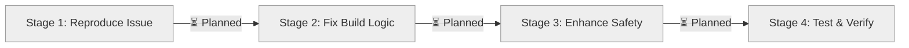

# Progress: Fix Incremental Deployment Logic

**Issue**: #10
**Status**: ⏳ Planning
**Started**: 2025-11-02
**Completed**: -

---

## Progress Dashboard

---

## Stage Status

| Stage | Status | Started | Completed | Duration | Commits |
|-------|--------|---------|-----------|----------|---------|
| 1. Reproduce Issue | ⏳ Planned | - | - | 0.5d | - |
| 2. Fix Build Logic | ⏳ Planned | - | - | 0.25d | - |
| 3. Enhance Safety | ⏳ Planned | - | - | 0.25d | - |
| 4. Test & Verify | ⏳ Planned | - | - | 0.5d | - |

**Overall Progress**: 0% (0/4 stages complete)

---

## Current Status

**Phase**: Planning - Detailed Stage Plans Created
**Blockers**: None
**Next Action**: Begin Stage 1 - Reproduce Issue

---

## Metrics

- **Production Impact**: CRITICAL (corporate site 404)
- **Affected Components**: Corporate site, documentation deployment
- **Resolution Target**: 1.5 days (12 hours)

---

## Related Issues

- Epic #2: GitHub Pages Federation (parent)
- Child #5: Testing & Validation (BLOCKED by this issue)
- Issue #9: Documentation build errors (similar investigation)

---

**Last Updated**: 2025-11-02
**Document Version**: 1.1 (4 stages structure)
