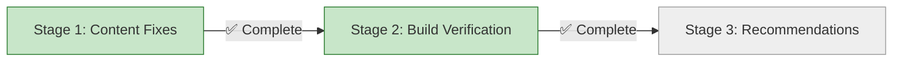

# Progress: Fix Documentation Sites Build Errors

**Issue**: #9
**Status**: 🔄 In Progress
**Started**: 2025-11-01 08:57 UTC
**Target Completion**: 2025-11-01

---

## Progress Dashboard

---

## Stage Status

| Stage | Status | Started | Completed | Duration | Commits |
|-------|--------|---------|-----------|----------|---------|
| 1. Content Fixes | ✅ Complete | 2025-11-01 08:57 | 2025-11-01 10:22 | 1.5h | [db431c3](https://github.com/info-tech-io/hugo-templates/commit/db431c3), [ac82d31](https://github.com/info-tech-io/info_tech_cli/commit/ac82d31) |
| 2. Build Verification | ✅ Complete | 2025-11-01 11:20 | 2025-11-01 12:18 | 1h | Workflow 18996122733 |
| 3. Recommendations | ⏳ Ready | - | - | 0.25d | - |

**Overall Progress**: 67% (2/3 stages complete)

---

## Sites Status

| Documentation Site | Local Build | Production Status | Result |
|-------------------|-------------|-------------------|--------|
| quiz | ✅ 44KB | ✅ 200 OK | ✅ Maintained |
| web-terminal | ✅ 43KB | ✅ 200 OK | ✅ Maintained |
| **hugo-templates** | ✅ **131KB** | ✅ **200 OK** | 🎉 **FIXED** |
| **info-tech-cli** | ✅ **45KB** | ✅ **200 OK** | 🎉 **FIXED** |

**PRIMARY OBJECTIVE ACHIEVED**: ✅ All 4 documentation sites return 200 OK
**Production URLs**: All accessible and serving HTML correctly

---

## Overall Metrics

- **Timeline**: Day 1 of 1.25 planned (67% complete)
- **Blockers**: None
- **Repositories Affected**: 2 (hugo-templates, info-tech-cli)
- **Commits Made**: 2 content fixes + 1 test commit
- **Files Fixed**: 4 total (2 in hugo-templates, 2 in info-tech-cli)
- **Builds Tested**: 4 local + 2 GitHub Actions + 4 production
- **Production URLs Fixed**: ✅ 2/2 (hugo-templates, info-tech-cli now return 200 OK)

---

## Detailed Progress

### Stage 1: Content Fixes
- **Status**: ✅ Complete
- **Progress**: 100%
- **Duration**: 1.5 hours (actual) vs 4 hours (planned)
- **Tasks Completed**: 6/6
- **Files Changed**:
  - ✅ hugo-templates/docs/content/developer-docs/components.md
  - ✅ hugo-templates/docs/content/tutorials/getting-started.md (additional fix)
  - ✅ info-tech-cli/docs/content/getting-started.md
  - ✅ info-tech-cli/docs/content/user-guide.md (additional fix)

### Stage 2: Build Verification
- **Status**: ✅ Complete
- **Progress**: 100%
- **Local Builds Verified**: 4/4 (all modules ✅)
- **CI/CD Runs Verified**: 2 (manual + repository_dispatch)
- **Production URLs Verified**: 4/4 (all return 200 OK ✅)
- **Live Update Test**: ✅ Passed (workflow triggered and deployed)

### Stage 3: Recommendations
- **Status**: ⏳ Planned
- **Progress**: 0%
- **Recommendations Drafted**: 0

---

## Risk Status

| Risk | Status | Notes |
|------|--------|-------|
| Local builds fail | ✅ Resolved | Both hugo-templates and info-tech-cli build successfully |
| CI/CD builds fail | ⏳ Not Assessed | Will test in Stage 2.2 |
| Production deployment fails | ⏳ Not Assessed | Will test in Stage 2.3 |
| Recommendations ignored | 🟢 Low Risk | For future improvement only |

---

## Related Issues

- **Epic #2**: GitHub Pages Federation (parent)
- **Child #5**: Testing & Validation (blocked by this issue)
- **Blocking**: Epic #2 progress cannot continue until fixed

---

## Quick Links

- **Design**: [design.md](design.md)
- **Investigation**: [investigation/root-cause-analysis.md](investigation/root-cause-analysis.md)
- **Issue**: https://github.com/info-tech-io/info-tech-io.github.io/issues/9

---

**Last Updated**: 2025-11-01 12:20 UTC
**Next Update**: After Stage 3 completion
**Document Version**: 1.2
