# Progress: Fix Documentation Sites Build Errors

**Issue**: #9
**Status**: ⏳ Planning
**Started**: 2025-10-31
**Target Completion**: 2025-11-01

---

## Progress Dashboard

```mermaid
graph LR
    A[Stage 1: Content Fixes] -->|⏳ Planned| B[Stage 2: Build Verification]
    B -->|⏳ Planned| C[Stage 3: Recommendations]

    style A fill:#eeeeee,stroke:#9e9e9e
    style B fill:#eeeeee,stroke:#9e9e9e
    style C fill:#eeeeee,stroke:#9e9e9e

    click A "001-content-fixes.md"
    click B "002-build-verification.md"
    click C "003-hugo-templates-recommendations.md"
```

---

## Stage Status

| Stage | Status | Started | Completed | Duration | Commits |
|-------|--------|---------|-----------|----------|---------|
| 1. Content Fixes | ⏳ Planned | - | - | 0.5d | - |
| 2. Build Verification | ⏳ Planned | - | - | 0.5d | - |
| 3. Recommendations | ⏳ Planned | - | - | 0.25d | - |

**Overall Progress**: 0% (0/3 stages complete)

---

## Sites Status

| Documentation Site | Current Status | Target Status | Priority |
|-------------------|----------------|---------------|----------|
| quiz | ✅ 200 OK | ✅ 200 OK (maintain) | High |
| web-terminal | ✅ 200 OK | ✅ 200 OK (maintain) | High |
| hugo-templates | ❌ 404 | 🎯 200 OK | **Critical** |
| info-tech-cli | ❌ 404 | 🎯 200 OK | **Critical** |

**Success Criteria**: All 4 sites return 200 OK

---

## Overall Metrics

- **Timeline**: Day 0 of 1.25 planned
- **Blockers**: None
- **Repositories Affected**: 2 (hugo-templates, info-tech-cli)
- **Commits Made**: 0
- **Commits Planned**: 2 (content fixes)
- **Builds Tested**: 0 local, 0 CI/CD
- **Production URLs Fixed**: 0/2

---

## Detailed Progress

### Stage 1: Content Fixes
- **Status**: ⏳ Not Started
- **Progress**: 0%
- **Tasks Completed**: 0/6
- **Files to Change**:
  - [ ] hugo-templates/docs/content/developer-docs/components.md
  - [ ] info-tech-cli/docs/content/getting-started.md

### Stage 2: Build Verification
- **Status**: ⏳ Not Started
- **Progress**: 0%
- **Local Builds Verified**: 0/4
- **CI/CD Runs Verified**: 0
- **Production URLs Verified**: 0/4

### Stage 3: Recommendations
- **Status**: ⏳ Not Started
- **Progress**: 0%
- **Recommendations Drafted**: 0

---

## Risk Status

| Risk | Status | Notes |
|------|--------|-------|
| Local builds fail | ⏳ Not Assessed | Will test in Stage 1 |
| CI/CD builds fail | ⏳ Not Assessed | Will test in Stage 2.2 |
| Production deployment fails | ⏳ Not Assessed | Will test in Stage 2.3 |
| Recommendations ignored | 🟢 Low Risk | For future improvement only |

---

## Related Issues

- **Epic #2**: GitHub Pages Federation (parent)
- **Child #5**: Testing & Validation (blocked by this issue)
- **Blocking**: Epic #2 progress cannot continue until fixed

---

## Quick Links

- **Design**: [design.md](design.md)
- **Investigation**: [investigation/root-cause-analysis.md](investigation/root-cause-analysis.md)
- **Issue**: https://github.com/info-tech-io/info-tech-io.github.io/issues/9

---

**Last Updated**: 2025-10-31 08:21 UTC
**Next Update**: After Stage 1 completion
**Document Version**: 1.0
