# Progress: Fix Documentation Sites Build Errors

**Issue**: #9
**Status**: 🔄 In Progress
**Started**: 2025-11-01 08:57 UTC
**Target Completion**: 2025-11-01

---

## Progress Dashboard

```mermaid
graph LR
    A[Stage 1: Content Fixes] -->|✅ Complete| B[Stage 2: Build Verification]
    B -->|⏳ Ready| C[Stage 3: Recommendations]

    style A fill:#c8e6c9,stroke:#2e7d32
    style B fill:#eeeeee,stroke:#9e9e9e
    style C fill:#eeeeee,stroke:#9e9e9e

    click A "001-content-fixes.md"
    click B "002-build-verification.md"
    click C "003-hugo-templates-recommendations.md"
```

---

## Stage Status

| Stage | Status | Started | Completed | Duration | Commits |
|-------|--------|---------|-----------|----------|---------|
| 1. Content Fixes | ✅ Complete | 2025-11-01 08:57 | 2025-11-01 10:22 | 1.5h | [db431c3](https://github.com/info-tech-io/hugo-templates/commit/db431c3), [ac82d31](https://github.com/info-tech-io/info_tech_cli/commit/ac82d31) |
| 2. Build Verification | ⏳ Ready | - | - | 0.5d | - |
| 3. Recommendations | ⏳ Planned | - | - | 0.25d | - |

**Overall Progress**: 33% (1/3 stages complete)

---

## Sites Status

| Documentation Site | Local Build | Production Status | Target Status | Priority |
|-------------------|-------------|-------------------|---------------|----------|
| quiz | ✅ Pass (not tested) | ✅ 200 OK | ✅ 200 OK (maintain) | High |
| web-terminal | ✅ Pass (not tested) | ✅ 200 OK | ✅ 200 OK (maintain) | High |
| hugo-templates | ✅ **Pass** (128KB) | ❌ 404 | 🎯 200 OK | **Critical** |
| info-tech-cli | ✅ **Pass** (44KB) | ❌ 404 | 🎯 200 OK | **Critical** |

**Stage 1 Success**: ✅ Local builds fixed
**Next Goal**: Verify production deployment in Stage 2

---

## Overall Metrics

- **Timeline**: Day 1 of 1.25 planned (33% complete)
- **Blockers**: None
- **Repositories Affected**: 2 (hugo-templates, info-tech-cli)
- **Commits Made**: 2 (content fixes)
- **Files Fixed**: 4 total (2 in hugo-templates, 2 in info-tech-cli)
- **Builds Tested**: 2 local (hugo-templates, info-tech-cli)
- **Production URLs Fixed**: 0/2 (awaiting Stage 2 deployment)

---

## Detailed Progress

### Stage 1: Content Fixes
- **Status**: ✅ Complete
- **Progress**: 100%
- **Duration**: 1.5 hours (actual) vs 4 hours (planned)
- **Tasks Completed**: 6/6
- **Files Changed**:
  - ✅ hugo-templates/docs/content/developer-docs/components.md
  - ✅ hugo-templates/docs/content/tutorials/getting-started.md (additional fix)
  - ✅ info-tech-cli/docs/content/getting-started.md
  - ✅ info-tech-cli/docs/content/user-guide.md (additional fix)

### Stage 2: Build Verification
- **Status**: ⏳ Ready to Start
- **Progress**: 0%
- **Local Builds Verified**: 2/4 (hugo-templates ✅, info-tech-cli ✅)
- **CI/CD Runs Verified**: 0
- **Production URLs Verified**: 0/4

### Stage 3: Recommendations
- **Status**: ⏳ Planned
- **Progress**: 0%
- **Recommendations Drafted**: 0

---

## Risk Status

| Risk | Status | Notes |
|------|--------|-------|
| Local builds fail | ✅ Resolved | Both hugo-templates and info-tech-cli build successfully |
| CI/CD builds fail | ⏳ Not Assessed | Will test in Stage 2.2 |
| Production deployment fails | ⏳ Not Assessed | Will test in Stage 2.3 |
| Recommendations ignored | 🟢 Low Risk | For future improvement only |

---

## Related Issues

- **Epic #2**: GitHub Pages Federation (parent)
- **Child #5**: Testing & Validation (blocked by this issue)
- **Blocking**: Epic #2 progress cannot continue until fixed

---

## Quick Links

- **Design**: [design.md](design.md)
- **Investigation**: [investigation/root-cause-analysis.md](investigation/root-cause-analysis.md)
- **Issue**: https://github.com/info-tech-io/info-tech-io.github.io/issues/9

---

**Last Updated**: 2025-11-01 10:25 UTC
**Next Update**: After Stage 2 completion
**Document Version**: 1.1
