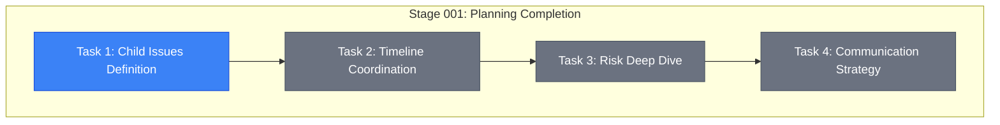

# Stage 001 Progress: Next Steps Planning

**Epic**: #12 Organization Migration
**Stage**: 001 - Planning Completion
**Started**: 2025-11-07 11:15 UTC
**Status**: 🔄 IN PROGRESS

---

## 📊 Stage Progress

**Progress**: 1/4 tasks started (25%)

---

## ✅ Completed Items

### ✅ Epic Foundation
- [x] **Epic Issue #12 Created** (2025-11-07 10:15)
  - Comprehensive epic description
  - Risk overview documented
  - Link: https://github.com/info-tech-io/info-tech-io.github.io/issues/12

- [x] **Documentation Structure** (2025-11-07 10:30)
  - Directory created: `docs/proposals/epic-12-organization-migration/`
  - Standard InfoTech.io structure followed

- [x] **Design Document Complete** (2025-11-07 10:45)
  - Comprehensive risk analysis
  - High-level implementation plan
  - Emergency procedures defined

- [x] **Progress Tracking Setup** (2025-11-07 11:00)
  - Mermaid diagrams for visualization
  - Milestone tracking framework

- [x] **Stage 001 Planning Started** (2025-11-07 11:15)
  - Detailed action plan created
  - Success criteria defined

---

## 🔄 Current Task: Child Issues Definition

### Sub-task Progress
- [ ] Child #1: Dependencies Analysis - **📋 PLANNING**
- [ ] Child #2: Pre-migration Preparation - **⏳ PENDING**
- [ ] Child #3: GitHub Migration - **⏳ PENDING**
- [ ] Child #4: Post-migration Updates - **⏳ PENDING**
- [ ] Child #5: Testing & Validation - **⏳ PENDING**
- [ ] Child #6: Production & Monitoring - **⏳ PENDING**

### Current Focus: Child #1 Design Document

**Objective**: Create detailed design for dependencies analysis methodology

**Progress**:
- Analysis methodology planned
- File scanning strategy defined
- Risk categorization framework ready
- Need to create GitHub issue and design.md

---

## ⏳ Upcoming Tasks (This Session)

### Next 1-2 hours
1. **Complete Child #1 Issue Creation**
   - Create GitHub issue
   - Write comprehensive design.md
   - Define specific analysis commands

2. **Start Child #2 Planning**
   - Begin pre-migration preparation design
   - Research GitHub Support coordination

### Rest of Session
3. **Complete remaining Child Issues**
   - Create all 6 GitHub issues
   - Write basic design.md for each
   - Ensure proper dependencies mapping

---

## 📈 Timeline Status

| Task | Estimated | Started | Progress | ETA |
|------|-----------|---------|----------|-----|
| **Task 1** | 1.5h | 11:15 | 20% | ~12:45 |
| **Task 2** | 0.5h | TBD | 0% | ~13:15 |
| **Task 3** | 0.5h | TBD | 0% | ~13:45 |
| **Task 4** | 0.5h | TBD | 0% | ~14:15 |

**Stage ETA**: ~14:15 UTC (3 hours total)

---

## 🎯 Success Metrics

### Completion Indicators
- [ ] 6 Child Issues exist in GitHub ✋ **0/6**
- [ ] 6 design.md files written ✋ **0/6**
- [ ] Timeline documented ✋ **Not started**
- [ ] Risk mitigation detailed ✋ **Not started**
- [ ] Communication plan ready ✋ **Not started**

### Quality Indicators
- [ ] Each Child has clear success criteria
- [ ] Dependencies mapped accurately
- [ ] Emergency procedures defined
- [ ] Resource requirements identified

---

## 📝 Session Log

### 2025-11-07 Session
**11:15** - Stage 001 planning document created
**11:20** - Progress tracking setup completed
**11:25** - Child #1 analysis methodology planning begun

**Next**: Create Child #1 GitHub issue and detailed design

---

## 🚧 Blockers & Risks

### Current Blockers
- **None** - Planning phase proceeding smoothly

### Potential Risks
- ⚠️ **Time Estimation**: Child Issues planning могут занять больше времени
- ⚠️ **Complexity**: Deep risk analysis может выявить дополнительные concerns
- ⚠️ **Dependencies**: External coordination requirements могут усложниться

### Mitigation Actions
- Keep planning focused и actionable
- Document assumptions для later validation
- Maintain conservative time estimates

---

**Last Updated**: 2025-11-07 11:25 UTC
**Next Update**: After Child #1 issue creation