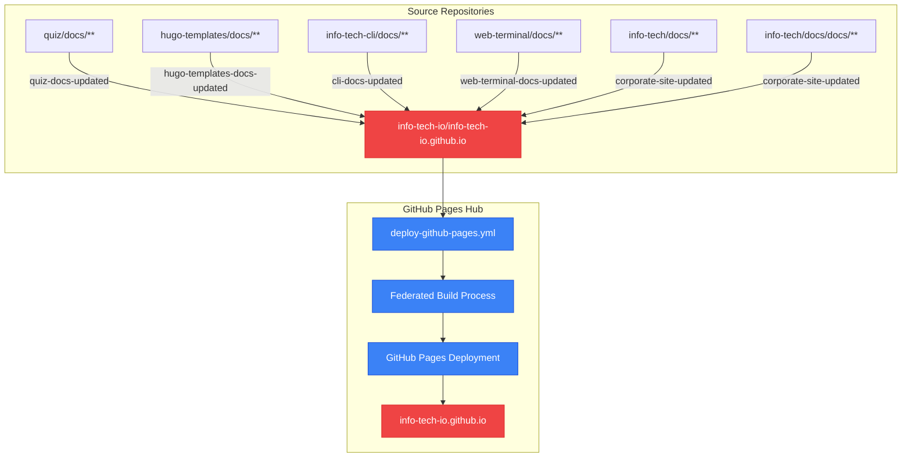
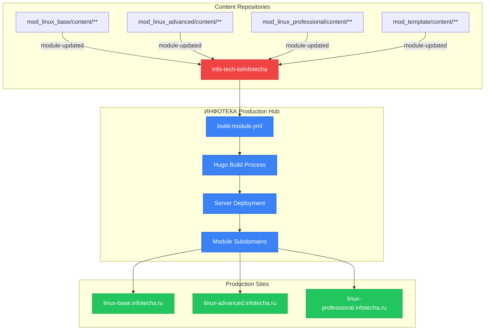

# Stage 2: Repository Dispatch Mapping - COMPLETE ANALYSIS

**Child**: #1 Dependencies Analysis
**Epic**: #12 Organization Migration
**Status**: ✅ COMPLETED
**Started**: 2025-11-07 12:45 UTC
**Completed**: 2025-11-07 13:00 UTC

---

## 🎯 Stage 2 Results Summary

Проведен comprehensive анализ всех repository dispatch automation chains и обнаружена **критическая сложность**: существуют **ДВЕ НЕЗАВИСИМЫЕ automation chains** с **10 repository references** требующих coordinated update.

---

## 🚨 CRITICAL DISCOVERY: Dual Automation Architecture

Repository dispatch analysis выявил **ДВЕ НЕЗАВИСИМЫЕ automation chains**:

1. **🌐 GitHub Pages Documentation Chain** (6 repos → info-tech-io.github.io)
2. **🏗️ ИНФОТЕКА Production Chain** (4 repos → info-tech-io/infotecha)

**Migration Impact**: **ОБЕИ chains** будут completely broken при organization rename

---

## 🌐 Chain 1: GitHub Pages Documentation Federation

### Target Repository: `info-tech-io/info-tech-io.github.io`

#### 📚 Documentation Products (4 repositories)

**1. Quiz Documentation**
```yaml
File: quiz/.github/workflows/notify-hub.yml
Trigger: push to main branch, docs/** paths
Event Type: quiz-docs-updated
Target: info-tech-io/info-tech-io.github.io    # Line 18: CRITICAL DEPENDENCY
Client Payload: repository, product, ref, sha
```

**2. Hugo Templates Documentation**
```yaml
File: hugo-templates/.github/workflows/notify-hub.yml
Trigger: push to main branch, docs/** paths
Event Type: hugo-templates-docs-updated
Target: info-tech-io/info-tech-io.github.io    # Line 18: CRITICAL DEPENDENCY
Client Payload: repository, product, ref, sha
```

**3. InfoTech CLI Documentation**
```yaml
File: info-tech-cli/.github/workflows/notify-hub.yml
Trigger: push to main branch, docs/** paths
Event Type: cli-docs-updated
Target: info-tech-io/info-tech-io.github.io    # Line 18: CRITICAL DEPENDENCY
Client Payload: repository, ref, sha
```

**4. Web Terminal Documentation**
```yaml
File: web-terminal/.github/workflows/notify-hub.yml
Trigger: push to main branch, docs/** paths
Event Type: web-terminal-docs-updated
Target: info-tech-io/info-tech-io.github.io    # Line 18: CRITICAL DEPENDENCY
Client Payload: repository, ref, sha
```

#### 🏢 Corporate Content (2 repositories)

**5. InfoTech Corporate Site**
```yaml
File: info-tech/.github/workflows/notify-hub.yml
Trigger: push to main branch, docs/** paths
Event Type: corporate-site-updated
Target: info-tech-io/info-tech-io.github.io    # Line 18: CRITICAL DEPENDENCY
Client Payload: repository, ref, sha
```

**6. InfoTech Docs Subfolder**
```yaml
File: info-tech/docs/.github/workflows/notify-hub.yml
Trigger: push to main branch, docs/** paths
Event Type: corporate-site-updated
Target: info-tech-io/info-tech-io.github.io    # Line 18: CRITICAL DEPENDENCY
Client Payload: repository, ref, sha
```

---

## 🏗️ Chain 2: ИНФОТЕКА Production Deployment

### Target Repository: `info-tech-io/infotecha`

#### 📖 Learning Content Modules (4 repositories)

**7. Linux Base Module**
```yaml
File: mod_linux_base/.github/workflows/notify-hub.yml
Trigger: push to main branch, content/** paths + workflow_dispatch
Event Type: module-updated
Target: info-tech-io/infotecha                  # Line 36: CRITICAL DEPENDENCY
Client Payload: module_name=linux_base, content_repo, timestamps, commit details
```

**8. Linux Advanced Module**
```yaml
File: mod_linux_advanced/.github/workflows/notify-hub.yml
Trigger: push to main branch, content/** paths + workflow_dispatch
Event Type: module-updated
Target: info-tech-io/infotecha                  # Line 19: CRITICAL DEPENDENCY
Client Payload: module_name=linux_advanced, content_repo, timestamps, commit details
```

**9. Linux Professional Module**
```yaml
File: mod_linux_professional/.github/workflows/notify-hub.yml
Trigger: push to main branch, content/** paths + workflow_dispatch
Event Type: module-updated
Target: info-tech-io/infotecha                  # Line 19: CRITICAL DEPENDENCY
Client Payload: module_name=linux_professional, content_repo, timestamps, commit details
```

**10. Module Template**
```yaml
File: mod_template/.github/workflows/notify-hub.yml
Trigger: push to main branch, content/** paths + workflow_dispatch
Event Type: module-updated
Target: info-tech-io/infotecha                  # Line 19: CRITICAL DEPENDENCY
Client Payload: module_name={{MODULE_NAME}}, content_repo={{REPO_NAME}}, timestamps, commit details
Note: Template with placeholder values
```

---

## 🔄 Complete Automation Flow Diagrams

### GitHub Pages Documentation Chain:


### ИНФОТЕКА Production Deployment Chain:


---

## 📊 Repository Dispatch Event Mapping

### GitHub Pages Workflow Integration:
В `info-tech-io.github.io/.github/workflows/deploy-github-pages.yml`:
```yaml
on:
  repository_dispatch:
    types:
      - corporate-site-updated        # Triggered by: info-tech, info-tech/docs
      - quiz-docs-updated            # Triggered by: quiz
      - hugo-templates-docs-updated  # Triggered by: hugo-templates
      - web-terminal-docs-updated    # Triggered by: web-terminal
      - cli-docs-updated            # Triggered by: info-tech-cli
```

### ИНФОТЕКА Workflow Integration:
В `infotecha/.github/workflows/build-module.yml`:
```yaml
on:
  repository_dispatch:
    types: [build-module]
  # Note: build-module.yml triggered by "module-updated" events
  # from all mod_* repositories
```

---

## 🚨 Critical Dependencies Matrix

| Chain | Repository | Notify File | Target | Dependency | Risk |
|-------|------------|-------------|--------|------------|------|
| **GitHub Pages** | quiz | notify-hub.yml:18 | info-tech-io/info-tech-io.github.io | ORG NAME | 🔴 HIGH |
| **GitHub Pages** | hugo-templates | notify-hub.yml:18 | info-tech-io/info-tech-io.github.io | ORG NAME | 🔴 HIGH |
| **GitHub Pages** | info-tech-cli | notify-hub.yml:18 | info-tech-io/info-tech-io.github.io | ORG NAME | 🔴 HIGH |
| **GitHub Pages** | web-terminal | notify-hub.yml:18 | info-tech-io/info-tech-io.github.io | ORG NAME | 🔴 HIGH |
| **GitHub Pages** | info-tech | notify-hub.yml:18 | info-tech-io/info-tech-io.github.io | ORG NAME | 🔴 HIGH |
| **GitHub Pages** | info-tech/docs | notify-hub.yml:18 | info-tech-io/info-tech-io.github.io | ORG NAME | 🔴 HIGH |
| **ИНФОТЕКА** | mod_linux_base | notify-hub.yml:36 | info-tech-io/infotecha | ORG NAME | 🔴 HIGH |
| **ИНФОТЕКА** | mod_linux_advanced | notify-hub.yml:19 | info-tech-io/infotecha | ORG NAME | 🔴 HIGH |
| **ИНФОТЕКА** | mod_linux_professional | notify-hub.yml:19 | info-tech-io/infotecha | ORG NAME | 🔴 HIGH |
| **ИНФОТЕКА** | mod_template | notify-hub.yml:19 | info-tech-io/infotecha | ORG NAME | 🔴 HIGH |

**Total Critical Dependencies**: **10 repository references** across **10 files**

---

## 🎛️ Migration Impact Assessment

### 🔴 IMMEDIATE BREAKING CHANGES

#### GitHub Pages Documentation (6 references)
- **Impact**: Complete documentation federation failure
- **Scope**: All product documentation (quiz, hugo-templates, cli, web-terminal)
- **User Impact**: No documentation updates, broken /docs/ site
- **Recovery Time**: Immediate если not fixed

#### ИНФОТЕКА Production (4 references)
- **Impact**: Module build automation failure
- **Scope**: All learning content updates
- **User Impact**: No new course content deployed
- **Recovery Time**: Manual workarounds possible

### 🟡 MEDIUM-TERM CONSEQUENCES

#### Automation Chain Breakdown
- **Documentation Chain**: 6 repos → 1 hub (broken dispatch chain)
- **Content Chain**: 4 repos → 1 hub (broken dispatch chain)
- **Manual Workarounds**: workflow_dispatch still available
- **Developer Impact**: No automated updates, manual triggers required

---

## 🔧 Update Strategy Requirements

### Critical Constraints:
1. **Simultaneous Updates Required**: All 10 files must be updated в same time window
2. **No Incremental Migration**: Partial updates = broken automation
3. **Cross-Repository Coordination**: 10 different repositories across organization
4. **Zero Fallback**: No intermediate state possible

### Update Sequence Planning:
```yaml
Pre-Migration:
  - Prepare 10 updated notify-hub.yml files
  - Validate new organization names
  - Test workflow syntax

Migration Day:
  - Batch update all 10 repositories simultaneously
  - Verify repository dispatch permissions
  - Test automation chains

Post-Migration:
  - Trigger test events для validation
  - Monitor automation workflows
  - Confirm end-to-end functionality
```

---

## 📈 Complexity Assessment

### Repository Coordination Challenge:
- **10 Repositories**: Requiring simultaneous updates
- **2 Target Hubs**: Different automation chains
- **Multiple Event Types**: 5 different event types
- **Cross-Dependencies**: Hub workflows depend on exact event type names

### Testing Requirements:
- **GitHub Pages Chain**: Test all 6 documentation sources
- **ИНФОТЕКА Chain**: Test all 4 module sources
- **End-to-End**: Verify complete automation flows
- **Rollback Plan**: Revert strategy для failures

---

## ✅ Stage 2 Deliverables

### ✅ Complete Automation Mapping
- **10 Repository dispatch workflows** fully analyzed
- **2 Distinct automation chains** identified и documented
- **Event flow diagrams** created с dependencies
- **Target repository mapping** completed

### ✅ Migration Strategy Framework
- **Simultaneous update requirement** identified
- **Cross-repository coordination** planned
- **Testing methodology** outlined
- **Risk assessment** completed

### ✅ Evidence Documentation
- **Line-by-line analysis** для all 10 files
- **Exact dependency references** documented
- **Event type mapping** verified
- **Target repository validation** completed

---

## 🔄 Handoff to Stage 3

### Ready for Stage 3: ИНФОТЕКА Impact Assessment
**Preparation Complete**: ✅ Repository dispatch analysis finished

**Key Findings для Stage 3**:
- ИНФОТЕКА automation workflows identified (4 source repos)
- Production impact scope defined
- Build automation dependencies mapped
- Module deployment chain documented

**Focus Areas для Stage 3**:
- Detailed ИНФОТЕКА workflow analysis
- Production system impact validation
- Build process safety confirmation
- Module deployment continuity assessment

---

**Stage 2 Status**: ✅ **COMPLETED**
**Critical Finding**: 10 repository dispatch chains require coordinated updates
**Next Stage**: Stage 3 - ИНФОТЕКА Impact Assessment
**Complexity Level**: 🔴 **HIGH** - Cross-repository coordination required

---

**Completed**: 2025-11-07 13:00 UTC
**Evidence**: 10 files analyzed, 2 automation chains mapped
**Review Status**: Ready для Stage 3 handoff