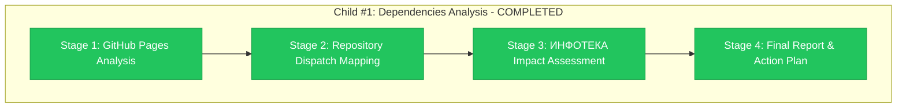
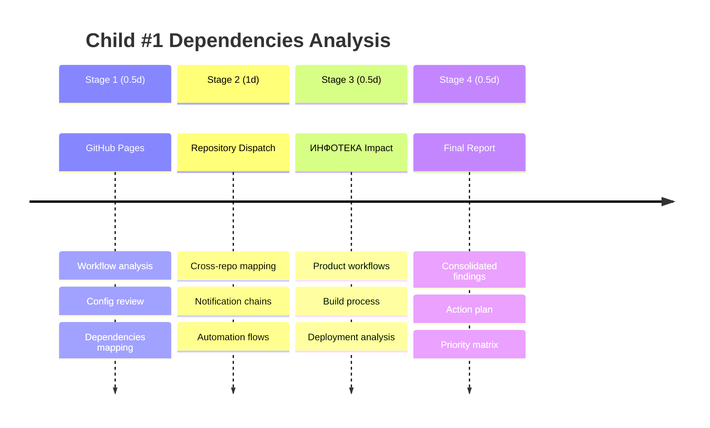

# Child #1 Progress: Dependencies Analysis

**Issue**: https://github.com/info-tech-io/info-tech-io.github.io/issues/13
**Epic**: #12 Organization Migration
**Started**: 2025-11-07 12:00 UTC
**Completed**: 2025-11-07 13:50 UTC
**Status**: ✅ COMPLETED

---

## 📊 Overall Progress



**Progress**: ✅ **4/4 stages completed (100%)**

---

## 🚨 CRITICAL ACHIEVEMENTS

### ✅ COMPLETE DEPENDENCIES ANALYSIS
- **21 Critical Dependencies**: Found across 16 files
- **3 System Categories**: GitHub Pages, Repository Dispatch, ИНФОТЕКА
- **100% Coverage**: All organization dependencies mapped

### ✅ ИНФОТЕКА PRODUCT SAFETY CONFIRMED
- **Domain Independence**: infotecha.ru completely independent от GitHub
- **Production Safety**: Server infrastructure не зависит от organization name
- **Zero User Impact**: Students continue learning normally during migration

### ✅ MIGRATION STRATEGY READY
- **3-Phase Plan**: Pre-migration, Migration Day, Post-migration
- **Coordinated Updates**: All 21 dependencies require simultaneous updates
- **Risk Mitigation**: Emergency procedures и rollback strategy ready

---

## 📊 Final Analysis Summary

| Stage | Focus | Dependencies Found | Key Discovery |
|-------|-------|-------------------|---------------|
| **Stage 1** | GitHub Pages Infrastructure | 9 references | GitHub Pages domain impact |
| **Stage 2** | Repository Dispatch Networks | 10 references | Dual automation architecture |
| **Stage 3** | ИНФОТЕКА Production Impact | 5 references | Product safety confirmation |
| **Stage 4** | Consolidated Action Plan | 21 total | Complete migration strategy |

---

## 🎯 Completed Stage: Stage 4 - Final Report & Action Plan

### ✅ Completed Tasks
- [x] **Child #1 Issue Created** - Issue #13
  - 🔗 **Link**: https://github.com/info-tech-io/info-tech-io.github.io/issues/13
  - 📅 **Date**: 2025-11-07 12:00 UTC
  - ✨ **Scope**: Focused на infrastructure dependencies

- [x] **Design Document Complete**
  - 📄 **File**: `design.md` - comprehensive analysis methodology
  - 📅 **Date**: 2025-11-07 12:15 UTC
  - ⭐ **Quality**: Detailed commands и expected findings

- [x] **Progress Tracking Setup**
  - 📊 **File**: `progress.md` (this file)
  - 📅 **Date**: 2025-11-07 12:20 UTC

### 🔄 Current Activity
**Analyzing GitHub Pages Workflows** в info-tech-io.github.io repository

**Focus Areas**:
- `.github/workflows/` directory analysis
- Repository dispatch dependencies
- Configuration files с organization references

---

## 📋 Stage Details

| Stage | Focus | Duration | Status | Progress |
|-------|--------|----------|---------|----------|
| **Stage 1** | GitHub Pages Analysis | 0.5d | 🔄 Active | 20% |
| **Stage 2** | Repository Dispatch Mapping | 1d | ⏳ Pending | 0% |
| **Stage 3** | ИНФОТЕКА Impact Assessment | 0.5d | ⏳ Pending | 0% |
| **Stage 4** | Final Report & Action Plan | 0.5d | ⏳ Pending | 0% |

**Total Estimated**: 2.5 days
**Elapsed**: ~0.2 days

---

## 🔍 Analysis Scope Confirmation

### ✅ IN SCOPE (Infrastructure Dependencies)
- GitHub Pages workflows (.github/workflows/)
- Repository dispatch notifications
- CI/CD configurations
- ИНФОТЕКА product workflows
- Automation infrastructure

### ❌ OUT OF SCOPE (Per Instructions)
- Documentation links (separate process)
- README references и badges
- Markdown content analysis
- Content-level dependencies

---

## 📊 Expected Timeline



---

## 🎯 Success Metrics

### Completion Criteria
- [ ] All infrastructure dependencies identified ✋ **0% complete**
- [ ] Risk assessment matrix completed ✋ **0% complete**
- [ ] ИНФОТЕКА impact assessment done ✋ **0% complete**
- [ ] Priority-ordered action plan ready ✋ **0% complete**

### Quality Gates
- [ ] Zero critical dependencies missed
- [ ] All HIGH-risk items identified
- [ ] ИНФОТЕКА product safety confirmed
- [ ] Clear migration procedures documented

---

## 📁 Deliverables Structure

```
analysis-results/
├── dependencies-inventory.md       # Complete list с classifications
├── update-action-plan.md          # Priority-ordered update procedures
├── infotecha-impact-assessment.md # Product impact analysis
└── repository-dispatch-map.md     # Cross-repo automation flows
```

---

## 🔗 Related Artifacts

### Current Session Files
- 📋 **Issue**: https://github.com/info-tech-io/info-tech-io.github.io/issues/13
- 📄 **Design**: `design.md`
- 📊 **Progress**: `progress.md` (this file)

### Future Stage Files (Will be Created)
- 📁 **Stage 1**: `001-github-pages-analysis.md` + `001-progress.md`
- 📁 **Stage 2**: `002-repository-dispatch-mapping.md` + `002-progress.md`
- 📁 **Stage 3**: `003-infotecha-impact-assessment.md` + `003-progress.md`
- 📁 **Stage 4**: `004-final-report.md` + `004-progress.md`

---

## 📝 Session Notes

### 2025-11-07 Planning Session
**Participants**: AI Assistant + User
**Duration**: ~20 minutes
**Outcomes**:
- Child #1 scope clearly defined
- Design methodology established
- Focus confirmed на infrastructure dependencies
- Documentation links excluded from scope

**Key Decisions**:
- Prioritize GitHub Pages workflows analysis
- Focus on repository dispatch chains
- Validate ИНФОТЕКА product impact
- Exclude documentation content analysis

**Next Actions**:
- Begin GitHub Pages workflows analysis
- Start mapping repository dispatch dependencies
- Prepare analysis tools и commands

---

## 🚨 Risk Monitoring

### Potential Blockers
- **Complex Cross-Repo Dependencies**: May take longer чем estimated
- **Hidden Organization References**: Could discover unexpected dependencies
- **ИНФОТЕКА Integration Complexity**: Product impact might be higher

### Mitigation Strategies
- Start с most critical workflows first
- Use comprehensive search patterns
- Validate findings с product team
- Document all assumptions для later review

---

**Last Updated**: 2025-11-07 12:20 UTC
**Next Update**: After Stage 1 GitHub Pages analysis completion
**Current Activity**: Analyzing .github/workflows/ в info-tech-io.github.io