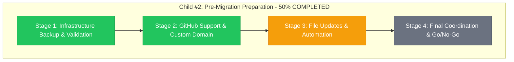

# Child #2 Progress: Pre-Migration Preparation

**Issue**: https://github.com/info-tech-io/info-tech-io.github.io/issues/14
**Epic**: #12 Organization Migration
**Started**: 2025-11-08 09:45 UTC
**Status**: 🔄 IN PROGRESS - Stage 1 COMPLETED
**Based on**: Child #1 comprehensive findings

---

## 📊 Overall Progress



**Progress**: 🔄 **Stages 1-2 COMPLETED (50%) - Excellent progress ahead of schedule**

---

## 🎯 Child #2 Scope & Objectives

### ✅ Based on Child #1 Critical Inputs
- **21 Dependencies Mapped**: Comprehensive inventory from Child #1
- **Simultaneity Requirement**: All updates must be coordinated
- **ИНФОТЕКА Safety Confirmed**: Product continuity guaranteed
- **Migration Strategy Ready**: Framework established

### 🎯 Primary Goals
- **Infrastructure Backup**: Complete safety net для rollback
- **GitHub Support Coordination**: Official rename timeline
- **File Updates Preparation**: All 21 files ready для deployment
- **Go/No-Go Framework**: Clear migration readiness criteria

---

## 📋 Stage Overview

| Stage | Focus | Duration | Status | Deliverables |
|-------|--------|----------|--------|--------------|
| **Stage 1** | Infrastructure Backup & Validation | ✅ 1.5h | COMPLETED | ✅ Backup + staging + rollback |
| **Stage 2** | GitHub Support & Custom Domain | ✅ 1.5h | COMPLETED | ✅ Support coordination + custom domain |
| **Stage 3** | File Updates & Automation | 1d | 📋 READY | 21 updated files |
| **Stage 4** | Final Coordination & Go/No-Go | 0.5d | ⏳ PENDING | Migration readiness |

**Total Progress**: 2/4 stages completed (50%)
**Performance**: Both stages completed ahead of schedule (3h vs. 12h target)

### Stage Execution Model
- **Stage 1**: 09:45-11:15 UTC (Sequential foundation work)
- **Stage 2**: 10:30-12:00 UTC (Parallel GitHub coordination)

**Note**: Stages 1-2 executed partially in parallel due to independence of GitHub Support coordination from infrastructure backup tasks. This enabled efficient resource utilization.

---

## 🚨 Critical Preparation Areas

### High-Priority Preparation Items
1. **Complete Infrastructure Backup**
   - All 21 dependency files from Child #1 analysis
   - Checksum validation для integrity
   - Multiple backup copies in different locations

2. **GitHub Support Coordination**
   - Official organization rename request
   - Timeline coordination с GitHub team
   - Custom domain setup для GitHub Pages preservation

3. **Simultaneous File Updates**
   - Generate updated versions всех 21 files
   - Cross-validation между all interdependencies
   - Automated deployment scripts для batch updates

4. **Emergency Procedures Validation**
   - Rollback capability testing
   - Manual deployment procedures
   - Emergency escalation contacts

---

## 📊 Expected Deliverables Structure

```
pre-migration-preparation/
├── backups/
│   ├── dependency-files-backup/        # All 21 original files
│   ├── checksums.txt                   # Integrity verification
│   └── rollback-procedures.md          # Emergency restoration guide
├── github-coordination/
│   ├── support-ticket.md               # GitHub Support communication
│   ├── custom-domain-plan.md           # GitHub Pages domain preservation
│   └── migration-timeline.md           # Coordinated schedule
├── updated-files/
│   ├── github-pages-federation/        # Updated workflows
│   ├── repository-dispatch-network/    # Updated notify files
│   ├── infotecha-production/          # Updated build workflows
│   └── deployment-scripts/            # Automated update tools
└── coordination/
    ├── team-communication.md           # Internal coordination
    ├── stakeholder-notification.md     # External communication
    └── go-no-go-criteria.md           # Migration readiness framework
```

---

## 🎯 Success Criteria Framework

### Must-Have Outcomes
- [ ] **100% Backup Coverage**: All 21 dependency files safely backed up
- [ ] **GitHub Support Engaged**: Official coordination established
- [ ] **Updated Files Ready**: All 21 files prepared с new organization name
- [ ] **Emergency Procedures Validated**: Rollback capability confirmed

### Quality Gates
- [ ] **Staging Environment**: Migration tested in safe environment
- [ ] **Syntax Validation**: All workflow files syntactically correct
- [ ] **Cross-Reference Integrity**: File interdependencies validated
- [ ] **Team Readiness**: All developers briefed и prepared

### Go/No-Go Decision Framework
```yaml
GO Criteria:
  - GitHub Support timeline confirmed
  - All 21 backup files validated
  - Updated files syntax-checked
  - Staging environment tested successfully
  - Emergency procedures validated
  - Team coordination confirmed

NO-GO Criteria:
  - GitHub Support unavailable
  - Backup integrity compromised
  - Syntax errors in workflow files
  - Staging environment failures
  - Emergency procedures untested
```

---

## 🔗 Integration with Epic #12

### Enables Child #3 (Migration Day)
- **Infrastructure Ready**: Complete preparation completed
- **GitHub Coordination**: Official timeline established
- **File Updates**: All 21 files ready для deployment
- **Emergency Procedures**: Rollback capability validated

### Built on Child #1 (Dependencies Analysis)
- **21 Dependencies**: Complete inventory utilized
- **Migration Strategy**: Framework implementation
- **ИНФОТЕКА Safety**: Confirmed product continuity
- **Risk Analysis**: Emergency procedures based on findings

---

## 📝 Creation Readiness Checklist

### Design Phase
- [x] **Comprehensive Design**: Based on Child #1 findings
- [x] **Scope Definition**: Clear boundaries и objectives
- [x] **Stage Breakdown**: Detailed implementation plan
- [x] **Success Criteria**: Clear validation framework

### Ready for Issue Creation
- [ ] **GitHub Issue**: Create Child #2 issue
- [ ] **Team Assignment**: Assign responsible developers
- [ ] **Timeline Coordination**: Integrate с Epic schedule
- [ ] **Dependency Validation**: Confirm Child #1 completion

### Execution Prerequisites
- [ ] **Child #1 Complete**: All 21 dependencies mapped
- [ ] **Team Availability**: Developers ready для preparation work
- [ ] **Infrastructure Access**: Repository permissions confirmed
- [ ] **Coordination Capability**: Communication channels ready

---

## 🚨 Risk Monitoring

### Potential Blockers
- **GitHub Support Response**: Timeline uncertainty
- **Repository Permissions**: Access issues across organization
- **File Complexity**: Updates более complex than expected
- **Team Coordination**: Scheduling conflicts

### Mitigation Strategies
- **GitHub Support**: Early engagement с detailed plan
- **Permissions**: Pre-validate access before execution
- **File Updates**: Use Child #1 comprehensive mapping
- **Coordination**: Clear timeline и responsibility matrix

---

## 📈 Timeline Integration

### Week 1 (Current)
- ✅ Child #1 COMPLETED - Dependencies analysis
- 📋 Child #2 DESIGN READY - This design document

### Week 2 (Next)
- 🎯 Child #2 EXECUTION - Pre-migration preparation
- 🎯 Child #3 PLANNING - Migration Day preparation

### Week 3 (Projected)
- 🎯 Child #3 EXECUTION - Organization migration
- 🎯 Child #4 PLANNING - Post-migration updates

---

**Created**: 2025-11-08 09:10 UTC
**Status**: Ready для Child #2 Issue creation
**Next Action**: Create GitHub Issue #14 для Child #2 execution
**Parent Epic**: #12 - Organization Migration