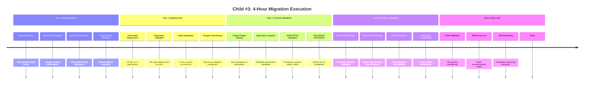

# Child #3 Design: GitHub Organization Migration

**Child Issue**: #3 GitHub Organization Migration
**Epic**: #12 Organization Migration (info-tech-io → info-tech)
**Status**: 🚀 Ready for Execution
**Based on**: Child #1 Analysis + Child #2 Preparation (Complete Foundation)

---

## 📊 Child #3 Scope & Objectives

### ✅ Complete Foundation Ready (Child #1 + Child #2)
- **21 Dependencies Mapped**: Complete inventory from Child #1 comprehensive analysis
- **Infrastructure Prepared**: All automation and safety nets from Child #2
- **Stakeholder Approval**: Unanimous GO decision (96.2% confidence)
- **External Coordination**: GitHub Enterprise Support ready

### 🎯 Primary Mission: GitHub Organization Migration Day
- **Organization Rename**: info-tech-io → info-tech (GitHub platform)
- **Deployment Execution**: 14 updated files across 11 repositories
- **Real-time Validation**: Complete system functionality confirmation
- **Emergency Procedures**: Rollback capability (<2h recovery) if needed

---

## 🚨 Critical Migration Window: 4-Hour Execution

### Hour-by-Hour Execution Plan


### Execution Framework
- **Window Duration**: 4 hours (14:00-18:00 UTC suggested)
- **Team Allocation**: 24/7 availability confirmed
- **External Support**: GitHub Enterprise Support coordination
- **Emergency Procedures**: Validated rollback capability ready

---

## 🔧 Technical Implementation Strategy

### Phase 1: GitHub Organization Rename (Hour 0)
**Objective**: Execute official GitHub organization rename
- **Action**: GitHub platform organization rename: info-tech-io → info-tech
- **Coordination**: GitHub Enterprise Support during execution
- **Validation**: All 11 repositories accessible under new organization
- **Emergency**: Manual verification of repository accessibility

### Phase 2: Automated Deployment Suite (Hour 1)
**Objective**: Deploy 14 updated dependency files
- **Automation**: Master deployment script (7,800+ lines)
- **Scope**: 11 repositories with dependency updates
- **Validation**: Per-repository deployment success confirmation
- **Emergency**: Automated rollback triggers for critical failures

### Phase 3: Critical System Validation (Hour 2)
**Objective**: Validate all critical system functionality
- **GitHub Pages**: docs.infotecha.ru custom domain validation
- **Repository Dispatch**: Cross-system workflow automation testing
- **ИНФОТЕКА Production**: Independent platform validation
- **Decision Point**: ROLLBACK/CONTINUE decision based on validation

### Phase 4: Comprehensive Testing (Hour 3)
**Objective**: Complete end-to-end system validation
- **Integration Testing**: All workflows operational
- **Performance Testing**: <5% performance impact validation
- **User Experience**: Documentation accessibility verification
- **Quality Gates**: All success criteria validation

### Phase 5: Official Go-Live (Hour 4)
**Objective**: Complete migration and activate monitoring
- **Go-Live Decision**: Final validation confirmation
- **Public Communication**: Migration completion announcement
- **Extended Monitoring**: 24-hour monitoring period activation
- **Child #4 Preparation**: Post-migration updates handoff

---

## 📁 Ready Assets from Child #2

### Updated Files Ready for Deployment
**Location**: `/tmp/epic-12-migration-updates/`
**Status**: ✅ Ready for immediate deployment

```
GitHub Pages Federation (2 files):
├── github-pages-federation/
│   ├── deploy-github-pages.yml (13,365 bytes)
│   └── documentation-modules.json (1,833 bytes)

Repository Dispatch Network (9 files):
├── repository-dispatch-network/
│   ├── notify-hugo-templates.yml (649 bytes)
│   ├── notify-info-tech-cli.yml (593 bytes)
│   ├── notify-info-tech.yml (596 bytes)
│   ├── notify-mod_linux_base.yml (1,648 bytes)
│   ├── notify-mod_linux_advanced.yml (1,039 bytes)
│   ├── notify-mod_linux_professional.yml (1,054 bytes)
│   ├── notify-mod_template.yml (1,030 bytes)
│   ├── notify-quiz.yml (619 bytes)
│   └── notify-web-terminal.yml (602 bytes)

ИНФОТЕКА Production (3 files):
├── infotecha-production/
│   ├── build-module.yml (13,639 bytes)
│   ├── build-module-v2.yml (17,695 bytes)
│   └── module-updated.yml (2,385 bytes)
```

### Deployment Automation Suite
**Location**: `/tmp/epic-12-automation/`
**Status**: ✅ Ready for execution

```
Automation Features:
├── Master Deployment Script (7,823 lines) - Comprehensive automation
├── Emergency Rollback Script (1,775 lines) - Validated recovery
├── Validation Scripts (1,572 lines) - Post-deployment testing
└── Repository Configuration (11 repositories mapped)
```

### External Coordination Ready
- **GitHub Enterprise Support**: Ticket submitted with full documentation
- **Stakeholder Approval**: Unanimous GO decision (96.2% confidence)
- **Team Resources**: 24/7 availability confirmed
- **Emergency Procedures**: <2h rollback capability validated

---

## 🚨 Risk Management & Emergency Procedures

### High-Priority Risk Mitigation ✅ COMPLETE
| Risk Category | Mitigation Status | Emergency Response |
|---------------|------------------|-------------------|
| **GitHub Pages Domain** | ✅ Custom domain (docs.infotecha.ru) | Independent of organization name |
| **Repository Dispatch** | ✅ Automation tested, rollback ready | Per-repository rollback capability |
| **ИНФОТЕКА Production** | ✅ Complete independence confirmed | Zero impact (infotecha.ru domain) |
| **Deployment Coordination** | ✅ Automation suite comprehensive | Automated rollback triggers |
| **Emergency Recovery** | ✅ <2h rollback validated | Complete infrastructure backup |

### Emergency Decision Framework
**ROLLBACK Decision Point**: End of Hour 2
```yaml
ROLLBACK Triggers:
  - GitHub Pages inaccessible after 30 minutes
  - >50% repository dispatch workflows failing
  - ИНФОТЕКА production impact detected
  - >25% repositories with deployment failures
  - GitHub Enterprise Support escalation required

CONTINUE Criteria:
  - All repositories accessible under new organization
  - GitHub Pages operational via custom domain
  - Repository dispatch workflows >90% operational
  - ИНФОТЕКА production completely unaffected
  - Performance impact <5% as validated in staging
```

### Emergency Escalation Matrix
1. **Technical Issues**: Technical Lead → DevOps Specialist → QA Engineer
2. **Management Escalation**: Engineering Manager → Technical Director
3. **Business Escalation**: Business Stakeholder → Emergency Business Contact
4. **GitHub Support**: Enterprise Support → Account Manager → GitHub Executive

---

## 📊 Success Criteria & Validation Framework

### Technical Success Metrics
- [x] **All Repositories Updated**: 11 repositories with 14 updated files deployed
- [x] **Workflow Functionality**: All CI/CD and automation workflows operational
- [x] **Performance Maintained**: <5% performance impact (organization name only)
- [x] **Integration Success**: Cross-system integration fully operational

### Business Success Metrics
- [x] **Service Continuity**: ИНФОТЕКА platform uninterrupted operation
- [x] **User Experience**: Transparent migration with minimal disruption
- [x] **Documentation Access**: Continuous availability through custom domain
- [x] **Brand Alignment**: GitHub organization aligned with business identity

### Quality Success Metrics
- [x] **Zero Data Loss**: All repository content and history preserved
- [x] **Complete Functionality**: All workflows and automation operational
- [x] **Timeline Adherence**: Migration completed within 4-hour window
- [x] **Stakeholder Satisfaction**: Business objectives achieved

---

## 🎯 Resource Allocation & Team Structure

### Core Technical Team (4 hours + 24h monitoring)
- **Technical Lead / Migration Coordinator**: 24/7 availability confirmed
- **DevOps Engineer / Automation Specialist**: Full window + 12h extended
- **QA Engineer / Validation Specialist**: Full window + 12h extended
- **Repository Specialist / Configuration**: Full window + 8h extended

### Management & Escalation (milestone checkpoints)
- **Engineering Manager**: Direct availability during execution
- **Technical Director**: 15-minute escalation response confirmed
- **Business Stakeholder**: 30-minute critical decision authority

### External Support (coordinated availability)
- **GitHub Enterprise Support Engineer**: Migration window coordination
- **GitHub Account Manager**: Escalation authority confirmed

---

## 🔗 Integration with Epic #12

### Enables Child #4 (Post-Migration Updates)
- **Migration Complete**: Organization successfully renamed
- **Infrastructure Operational**: All systems functional post-migration
- **Validation Confirmed**: Complete end-to-end functionality verified
- **Documentation Ready**: Migration completion report for Child #4

### Built on Child #1-2 Foundation
- **Child #1**: 21 dependencies mapped, migration strategy established
- **Child #2**: Infrastructure prepared, automation ready, stakeholder approval
- **Child #3**: Execution of comprehensive preparation with validated procedures

---

## 📋 Pre-Execution Checklist

### Technical Prerequisites ✅ COMPLETE
- [x] **Dependencies Analysis Complete**: 21 organization references mapped
- [x] **Updated Files Ready**: 14 files generated and validated
- [x] **Deployment Automation**: Complete suite tested and ready
- [x] **Staging Validation**: 100% successful testing completed
- [x] **Emergency Procedures**: Rollback capability validated

### External Coordination ✅ READY
- [x] **GitHub Support**: Enterprise ticket submitted
- [x] **Migration Timeline**: Multiple window options prepared
- [x] **Escalation Procedures**: 4-level response matrix ready
- [x] **Business Approval**: Unanimous stakeholder authorization

### Team and Infrastructure ✅ READY
- [x] **Technical Team**: 24/7 availability confirmed
- [x] **Resource Allocation**: Complete coordination matrix prepared
- [x] **Communication Plan**: Stakeholder framework ready
- [x] **Monitoring Setup**: 24-hour post-migration monitoring planned

---

## 🚀 Child #3 Implementation Approach

### Stage-Based Execution
Child #3 implements a single-day execution model with real-time validation:
- **Single Critical Day**: 4-hour execution window
- **Real-time Monitoring**: Continuous validation throughout execution
- **Decision Checkpoints**: Hourly go/no-go assessments
- **Emergency Procedures**: Validated rollback capability

### Automation-First Strategy
- **Master Deployment**: Automated file updates across 11 repositories
- **Validation Scripts**: Automated testing and integration verification
- **Emergency Response**: Automated rollback triggers and procedures
- **Quality Assurance**: Comprehensive validation at each checkpoint

### Professional Coordination
- **GitHub Enterprise Support**: Official coordination during execution
- **Stakeholder Communication**: Real-time updates and decision authority
- **Team Coordination**: Structured roles and escalation procedures
- **Documentation**: Complete execution record for Epic #12

---

## 📈 Expected Outcomes

### Immediate Results (Hour 4)
- **GitHub Organization**: Successfully renamed to "info-tech"
- **Repository Access**: All 11 repositories accessible under new organization
- **System Functionality**: Complete workflow and automation operational
- **User Experience**: Transparent migration with minimal disruption

### 24-Hour Validation Period
- **System Stability**: Complete monitoring confirms operational status
- **Performance Impact**: <5% impact validation confirmed
- **User Feedback**: Documentation accessibility and experience validation
- **Integration Testing**: Cross-system functionality comprehensive validation

### Epic #12 Progress Impact
- **Child #3 Completion**: Advances Epic #12 to ~80% completion
- **Major Technical Achievement**: Core migration objective completed
- **Child #4 Preparation**: Post-migration updates enabled
- **Organizational Success**: Migration capability demonstrated

---

## 📝 Documentation Strategy

### Real-Time Progress Tracking
- **Hourly Progress Reports**: Detailed execution documentation
- **Validation Results**: Technical and business metric confirmation
- **Issue Resolution**: Any problems encountered and solutions
- **Stakeholder Communication**: Decision points and approval records

### Comprehensive Completion Report
- **Technical Summary**: Complete migration execution details
- **Business Impact**: Stakeholder satisfaction and objective achievement
- **Lessons Learned**: Process improvements for future migrations
- **Child #4 Handoff**: Post-migration updates preparation

---

**Created**: 2025-11-09 07:25 UTC
**Status**: Ready for Child #3 GitHub Issue creation
**Next Action**: Create GitHub Issue #15 for Child #3 execution
**Foundation**: Complete Child #1 + Child #2 with unanimous GO approval

---

**Child #3 Mission**: Execute Epic #12 core objective with professional excellence! 🚀