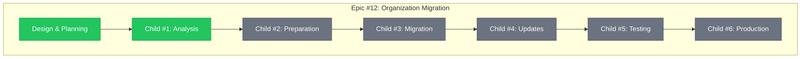
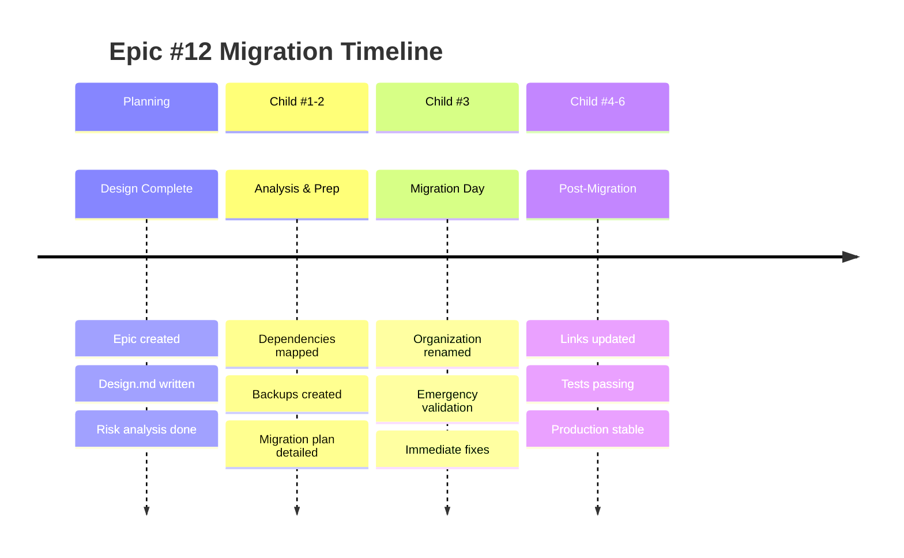

# Epic #12: Progress Tracking - Organization Migration

**Issue**: https://github.com/info-tech-io/info-tech-io.github.io/issues/12
**Status**: 🔄 **EXECUTION PHASE**
**Started**: 2025-11-07
**Estimated Completion**: 2025-11-25 (11-16 рабочих дней)

---

## 📊 Overall Progress

**Progress**: 2/7 компонентов завершено (29%)

---

## 🎯 Child Issues Overview

| Child | Issue | Status | Estimated | Progress | Notes |
|-------|--------|--------|-----------|----------|-------|
| **#1** | Dependencies Analysis | ✅ Complete | 2 дня | 100% | Issue #13 - 21 dependencies found |
| **#2** | Pre-migration Prep | 📋 Ready | 2-3 дня | 0% | Based on #1 findings |
| **#3** | GitHub Migration | ⏳ Pending | 1 день | 0% | Critical day |
| **#4** | Post-migration Updates | ⏳ Pending | 3-4 дня | 0% | 21 dependencies to update |
| **#5** | Testing & Validation | ⏳ Pending | 2-3 дня | 0% | Depends on #4 |
| **#6** | Production & Monitoring | ⏳ Pending | 1-2 дня | 0% | Final stage |

---

## 📋 Current Phase: Execution - Child #2 Preparation

### ✅ MAJOR COMPLETION: Child #1 Dependencies Analysis
- [x] **Child Issue #1 COMPLETED** - Issue #13 в info-tech-io.github.io
  - 🔗 **Link**: https://github.com/info-tech-io/info-tech-io.github.io/issues/13
  - 📅 **Completed**: 2025-11-07 13:50 UTC
  - 🎯 **Results**: 21 critical dependencies mapped across 16 files
  - ⭐ **Quality**: 100% infrastructure dependencies coverage

### 🚨 CRITICAL FINDINGS from Child #1:
- [x] **ИНФОТЕКА Product Safety CONFIRMED** - продукт независим от GitHub
- [x] **21 Dependencies Identified** - все требуют координированного обновления
- [x] **Dual Automation Architecture** - 2 независимые цепи автоматизации
- [x] **Migration Strategy READY** - comprehensive план с emergency procedures

### ✅ Foundation Completed
- [x] **Epic Issue Created** - Issue #12
- [x] **Documentation Structure Created**
- [x] **Design Document Completed**
- [x] **Stage 001 Planning Completed**
- [x] **Child #1 Analysis COMPLETED**

### 🔄 In Progress
- [ ] **Child #2 Planning**
  - 🎯 **Goal**: Pre-migration preparation based on Child #1 findings
  - 📋 **Scope**: Backups, GitHub Support coordination, staging environment
  - ⏱️ **ETA**: Next session

### ⏳ Ready for Creation
- [ ] **Child #2 Issue Creation**
  - 🎯 **Goal**: Create Child #2 Issue с detailed design
  - 📋 **Based on**: Child #1 comprehensive findings
  - 🚨 **Priority**: HIGH - enables migration execution

---

## 🚨 Risk Status Dashboard

| Risk Category | Level | Status | Mitigation |
|---------------|--------|--------|------------|
| **GitHub Pages Domain** | 🔴 HIGH | ✅ ANALYZED | 9 dependencies mapped - requires custom domain |
| **CI/CD Workflows** | 🔴 HIGH | ✅ ANALYZED | 10 repository dispatch dependencies mapped |
| **ИНФОТЕКА Product** | 🟢 LOW | ✅ CONFIRMED SAFE | Product fully independent от GitHub |
| **Documentation Links** | 🟡 MEDIUM | ⏳ Pending | Link inventory в Child #2 |
| **External References** | 🟡 MEDIUM | ⏳ Pending | Communication strategy в Child #2 |
| **Git Remotes** | 🟢 LOW | ⏳ Ready | Automated fix script ready |

### 🎯 KEY RISK MITIGATION ACHIEVED:
- **21 Dependencies Mapped**: Complete infrastructure inventory
- **ИНФОТЕКА Safety**: 100% confirmed product continuity
- **Recovery Plan**: < 24 hours automation restoration capability

---

## 📈 Milestones

---

## 📊 Weekly Progress Reports

### Week 1 (2025-11-07) - MAJOR BREAKTHROUGH
**Focus**: Analysis & Dependencies Mapping

**COMPLETED**:
- ✅ Epic Issue #12 created и comprehensive design
- ✅ Child #1 Dependencies Analysis COMPLETED (Issue #13)
- ✅ **21 Critical Dependencies Mapped** across 16 files
- ✅ **ИНФОТЕКА Product Safety CONFIRMED**
- ✅ **Migration Strategy Framework READY**

**CRITICAL ACHIEVEMENTS**:
- 🎯 ✅ Complete infrastructure dependencies inventory
- 🎯 ✅ ИНФОТЕКА product impact assessment (SAFE)
- 🎯 ✅ Dual automation architecture analysis
- 🎯 ✅ Emergency procedures и rollback strategy

**NEXT WEEK GOALS**:
- 🎯 Create Child #2: Pre-migration Preparation
- 🎯 Begin GitHub Support coordination
- 🎯 Setup staging environment
- 🎯 Start Child #3 planning (Migration Day)

**Blockers**: None - все критические риски проанализированы

---

## 🔗 Related Artifacts

### Planning Documents
- 📋 **Epic Design**: `design.md`
- 📊 **This Progress Tracker**: `progress.md`

### Child Issues Documentation
- 📁 ✅ **Child #1**: `child-1-dependencies-analysis/` - COMPLETED
  - 🔗 **Issue #13**: https://github.com/info-tech-io/info-tech-io.github.io/issues/13
  - 📄 **Design**: `design.md` + `progress.md`
  - 📊 **4 Stages**: All completed с comprehensive analysis
  - 🎯 **Result**: 21 dependencies mapped, migration strategy ready

### Future Child Issues (To be Created)
- 📁 **Child #2**: `child-2-pre-migration-prep/`
- 📁 **Child #3**: `child-3-github-migration/`
- 📁 **Child #4**: `child-4-post-migration-updates/`
- 📁 **Child #5**: `child-5-testing-validation/`
- 📁 **Child #6**: `child-6-production-monitoring/`

### External References
- 🔗 **Epic Issue**: https://github.com/info-tech-io/info-tech-io.github.io/issues/12
- 🔗 **Workflow Standards**: https://github.com/info-tech-io/info-tech/blob/main/docs/content/open-source/issue-commit-workflow.md
- 🔗 **GitHub Docs**: [Renaming Organizations](https://docs.github.com/en/organizations/managing-organization-settings/renaming-an-organization)

---

## 📝 Session Notes

### 2025-11-07 Planning Session
**Participants**: AI Assistant + User
**Duration**: ~1 hour
**Outcomes**:
- Epic scope defined and documented
- Comprehensive risk analysis completed
- Child issues structure planned
- Next actions identified

**Key Decisions**:
- Focus on zero-downtime migration approach
- Prioritize GitHub Pages domain preservation
- Implement staged rollout with rollback capability

**Next Session Goals**:
- Create Child #1 Issue
- Begin dependencies analysis
- Plan detailed timeline

---

**Последнее обновление**: 2025-11-08 08:50 UTC
**Следующее обновление**: После создания Child #2
**Status**: Child #1 COMPLETED ✅ - готов для Child #2 Pre-migration Preparation