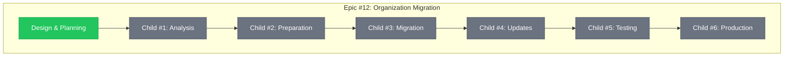
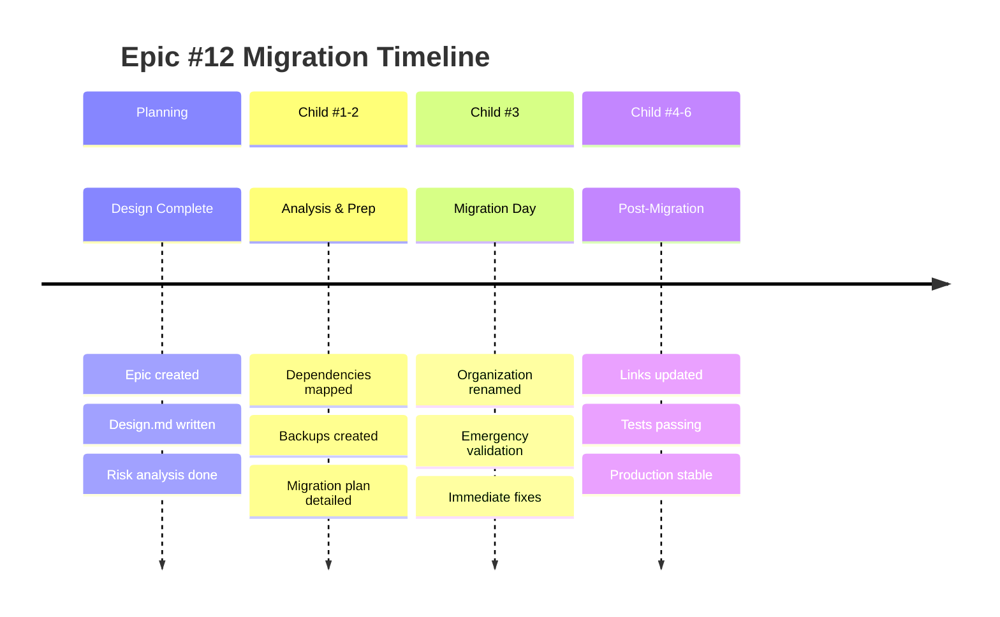

# Epic #12: Progress Tracking - Organization Migration

**Issue**: https://github.com/info-tech-io/info-tech-io.github.io/issues/12
**Status**: 🔄 **PLANNING PHASE**
**Started**: 2025-11-07
**Estimated Completion**: TBD (11-16 рабочих дней)

---

## 📊 Overall Progress

**Progress**: 1/7 компонентов завершено (14%)

---

## 🎯 Child Issues Overview

| Child | Issue | Status | Estimated | Progress | Notes |
|-------|--------|--------|-----------|----------|-------|
| **#1** | Dependencies Analysis | ⏳ Pending | 2-3 дня | 0% | Waiting for creation |
| **#2** | Pre-migration Prep | ⏳ Pending | 2-3 дня | 0% | Depends on #1 |
| **#3** | GitHub Migration | ⏳ Pending | 1 день | 0% | Critical day |
| **#4** | Post-migration Updates | ⏳ Pending | 3-4 дня | 0% | Depends on #3 |
| **#5** | Testing & Validation | ⏳ Pending | 2-3 дня | 0% | Depends on #4 |
| **#6** | Production & Monitoring | ⏳ Pending | 1-2 дня | 0% | Final stage |

---

## 📋 Current Phase: Planning & Design

### ✅ Completed Tasks
- [x] **Epic Issue Created** - Issue #12 в info-tech-io.github.io
  - 🔗 **Link**: https://github.com/info-tech-io/info-tech-io.github.io/issues/12
  - 📅 **Date**: 2025-11-07 10:15 UTC
  - ✨ **Notes**: Comprehensive epic description with risk analysis

- [x] **Documentation Structure Created**
  - 📁 **Path**: `/docs/proposals/epic-12-organization-migration/`
  - 📅 **Date**: 2025-11-07 10:30 UTC

- [x] **Design Document Completed**
  - 📄 **File**: `design.md` (comprehensive risk analysis & plan)
  - 📅 **Date**: 2025-11-07 10:45 UTC
  - ⭐ **Quality**: Detailed analysis включая emergency procedures

### 🔄 In Progress
- [ ] **Stages Planning**
  - 🎯 **Goal**: Детальная breakdown каждого Child Issue
  - ⏱️ **ETA**: В течение сессии

### ⏳ Pending
- [ ] **Child Issues Creation**
  - 🎯 **Goal**: Создание 6 Child Issues с детальными планами
  - 📋 **Dependencies**: Завершение stages planning

---

## 🚨 Risk Status Dashboard

| Risk Category | Level | Status | Mitigation |
|---------------|--------|--------|------------|
| **GitHub Pages Domain** | 🔴 HIGH | ⚠️ Not Addressed | Custom domain strategy needed |
| **CI/CD Workflows** | 🔴 HIGH | ⚠️ Not Addressed | Repository dispatch analysis needed |
| **Documentation Links** | 🟡 MEDIUM | ⚠️ Not Addressed | Link inventory required |
| **External References** | 🟡 MEDIUM | ⚠️ Not Addressed | Communication strategy needed |
| **Git Remotes** | 🟢 LOW | ⚠️ Not Addressed | Automated fix available |

---

## 📈 Milestones

---

## 📊 Weekly Progress Reports

### Week 1 (2025-11-07)
**Focus**: Planning & Analysis

**Completed**:
- ✅ Epic Issue #12 created
- ✅ Design document completed
- ✅ Risk analysis framework established

**Next Week Goals**:
- 🎯 Complete Child #1: Dependencies Analysis
- 🎯 Begin Child #2: Pre-migration Preparation
- 🎯 Coordinate with GitHub Support

**Blockers**: None

---

## 🔗 Related Artifacts

### Planning Documents
- 📋 **Epic Design**: `design.md`
- 📊 **This Progress Tracker**: `progress.md`

### Future Documentation (Will be Created)
- 📁 **Child #1**: `child-1-dependencies-analysis/`
- 📁 **Child #2**: `child-2-pre-migration-prep/`
- 📁 **Child #3**: `child-3-github-migration/`
- 📁 **Child #4**: `child-4-post-migration-updates/`
- 📁 **Child #5**: `child-5-testing-validation/`
- 📁 **Child #6**: `child-6-production-monitoring/`

### External References
- 🔗 **Epic Issue**: https://github.com/info-tech-io/info-tech-io.github.io/issues/12
- 🔗 **Workflow Standards**: https://github.com/info-tech-io/info-tech/blob/main/docs/content/open-source/issue-commit-workflow.md
- 🔗 **GitHub Docs**: [Renaming Organizations](https://docs.github.com/en/organizations/managing-organization-settings/renaming-an-organization)

---

## 📝 Session Notes

### 2025-11-07 Planning Session
**Participants**: AI Assistant + User
**Duration**: ~1 hour
**Outcomes**:
- Epic scope defined and documented
- Comprehensive risk analysis completed
- Child issues structure planned
- Next actions identified

**Key Decisions**:
- Focus on zero-downtime migration approach
- Prioritize GitHub Pages domain preservation
- Implement staged rollout with rollback capability

**Next Session Goals**:
- Create Child #1 Issue
- Begin dependencies analysis
- Plan detailed timeline

---

**Последнее обновление**: 2025-11-07 11:00 UTC
**Следующее обновление**: После создания Child #1