# Incremental Build Architecture Design

**Document Version**: 1.0
**Date**: 2025-09-29
**Epic**: #2 - Rebuild GitHub Pages Federation with Incremental Architecture
**Phase**: 1 - Investigation & Design
**Depends On**: current-state-analysis.md, workflow-analysis.md

## 🎯 Executive Summary

This document defines the complete architectural design for the new incremental build system that enables independent updates of corporate site and product documentation while maintaining full GitHub Pages federation functionality. The design preserves all existing Hugo Templates Framework capabilities while adding federation-specific enhancements.

## 🏗️ High-Level Architecture Overview

### Design Principles

1. **Incremental Updates**: New builds preserve existing content outside their scope
2. **Independent Operations**: Corporate and documentation updates don't interfere
3. **Backward Compatibility**: All existing functionality remains unchanged
4. **CSS Path Resolution**: Correct styling in both root and subdirectory contexts
5. **Atomic Deployments**: Complete success or complete rollback, no partial states
6. **Performance Optimization**: Maintain existing build performance characteristics

### Federation Structure
```
GitHub Pages (info-tech-io.github.io)
├── /                              # Corporate Site Domain
│   ├── index.html                 # Corporate landing page
│   ├── about/                     # Company information
│   ├── products/                  # Product overview
│   ├── open-source/               # Open source initiatives
│   ├── blog/                      # Corporate blog
│   └── assets/                    # Corporate assets (CSS, JS, images)
└── /docs/                         # Documentation Federation Domain
    ├── index.html                 # Documentation Hub navigation
    ├── quiz/                      # Quiz Engine documentation
    │   ├── index.html
    │   ├── assets/                # Product-specific assets
    │   └── ...
    ├── hugo-templates/            # Hugo Templates documentation
    ├── web-terminal/              # Web Terminal documentation
    └── info-tech-cli/             # Info-Tech CLI documentation
```

## 🔄 Incremental Build Strategy

### Core Concept: Download-Merge-Deploy Pattern

Instead of overwriting entire sites, the new architecture follows:

1. **Download Current State**: Retrieve existing GitHub Pages content
2. **Build New Content**: Generate only the content that needs updating
3. **Selective Merge**: Combine new content with existing, preserving other areas
4. **Deploy Atomically**: Upload complete merged result

### Workflow Separation Strategy

**Option A: Dual Independent Workflows (Recommended)**

Separate workflows with explicit coordination:

```mermaid
graph TB
    A[Corporate Content Change] --> B[Corporate Workflow]
    C[Documentation Change] --> D[Documentation Workflow]

    B --> E[Download Current Pages]
    B --> F[Build Corporate Site]
    B --> G[Merge: Corporate → Root, Preserve /docs/]
    B --> H[Deploy Complete Site]

    D --> I[Download Current Pages]
    D --> J[Build All Documentation]
    D --> K[Merge: Docs → /docs/, Preserve Root]
    D --> L[Deploy Complete Site]
```



**Benefits**:
- Clear separation of concerns
- Independent execution and debugging
- Isolated failure domains
- Easier testing and maintenance
- Better performance (only build what changed)

## 🛠️ Technical Implementation Design

### Phase 1: Hugo Templates Framework Enhancements

#### New Build Script Parameters

```bash
# Enhanced build.sh command-line interface
./scripts/build.sh [existing-options] [federation-options]

# New Federation Options:
--federated-build                    # Enable federation mode
--css-path-prefix <prefix>           # CSS path prefix (e.g., "/docs/quiz/")
--preserve-base-site                 # Don't overwrite existing site structure
--output-subdirectory <path>         # Deploy to subdirectory within existing site

# Example usage:
# Corporate build (root deployment):
scripts/build.sh --template=corporate --output=/tmp/corporate

# Documentation build (subdirectory deployment):
scripts/build.sh --template=documentation --federated-build \
  --css-path-prefix="/docs/quiz/" --output=/tmp/quiz-docs
```

#### Enhanced Module.json Schema

```json
{
  "template": "documentation",
  "theme": "compose",
  "hugo_config": {
    "template": "documentation",
    "theme": "compose"
  },
  "site": {
    "baseURL": "https://info-tech-io.github.io",
    "title": "Quiz Engine Documentation"
  },
  "federation": {
    "enabled": true,
    "cssPathPrefix": "/docs/quiz/",
    "staticAssetPrefix": "/docs/quiz/",
    "deploymentPath": "docs/quiz",
    "preserveExistingSite": true
  },
  "content": {
    "destination": "docs/quiz"
  }
}
```

#### CSS Path Resolution System

**Problem**: CSS paths like `../css/style.css` break when deployed to `/docs/product/`

**Solution**: Intelligent path prefix injection

```javascript
// New CSS processing in build.sh
function processCSSForFederation(cssContent, pathPrefix) {
  // Transform relative paths to federation-aware paths
  cssContent = cssContent.replace(
    /url\(['"]?\.\.?\//g,
    `url('${pathPrefix}/`
  );

  // Handle various CSS import patterns
  cssContent = cssContent.replace(
    /@import\s+['"]\.\.?\//g,
    `@import '${pathPrefix}/`
  );

  return cssContent;
}
```

### Phase 2: GitHub Actions Workflow Architecture

#### Corporate Site Workflow (New)

```yaml
# .github/workflows/deploy-corporate-incremental.yml
name: Deploy InfoTech.io Corporate Site (Incremental)

on:
  repository_dispatch:
    types: [corporate-site-updated]

jobs:
  incremental-corporate-build:
    runs-on: ubuntu-latest
    steps:
      # Step 1: Download existing GitHub Pages state
      - name: Download Current GitHub Pages
        run: |
          # Download latest GitHub Pages deployment
          gh api repos/info-tech-io/info-tech-io.github.io/pages/builds/latest
          # Extract and download current site state
          curl -L "$PAGES_DOWNLOAD_URL" | tar -xz -C current-site/

      # Step 2: Build corporate site
      - name: Build Corporate Site
        run: |
          git clone https://github.com/info-tech-io/info-tech.git content-corporate
          cd hugo-templates
          scripts/build.sh --template=corporate \
            --config ../content-corporate/docs/module.json \
            --content ../content-corporate/docs/content \
            --output ../temp-corporate \
            --force --no-cache

      # Step 3: Selective merge - preserve /docs/
      - name: Merge Corporate Content (Preserve Documentation)
        run: |
          # Copy corporate files to root, skip /docs/
          rsync -av --exclude='docs/' temp-corporate/ current-site/

          # Ensure /docs/ exists (create if missing)
          mkdir -p current-site/docs

          # Create fallback docs index if none exists
          [[ ! -f current-site/docs/index.html ]] && \
            cp templates/docs-fallback.html current-site/docs/index.html

      # Step 4: Deploy merged result
      - name: Deploy to GitHub Pages
        uses: actions/upload-pages-artifact@v3
        with:
          path: current-site
```

#### Documentation Federation Workflow (New)

```yaml
# .github/workflows/deploy-documentation-incremental.yml
name: Deploy InfoTech.io Documentation Federation (Incremental)

on:
  repository_dispatch:
    types: [
      quiz-docs-updated,
      hugo-docs-updated,
      web-terminal-docs-updated,
      cli-docs-updated
    ]

jobs:
  incremental-documentation-build:
    runs-on: ubuntu-latest
    steps:
      # Step 1: Download existing GitHub Pages state
      - name: Download Current GitHub Pages
        run: |
          # Same download logic as corporate workflow

      # Step 2: Build all documentation in parallel
      - name: Build Quiz Engine Documentation
        run: |
          git clone https://github.com/info-tech-io/quiz.git content-quiz
          cd hugo-templates
          scripts/build.sh --template=documentation \
            --config ../content-quiz/docs/module.json \
            --content ../content-quiz/docs/content \
            --federated-build --css-path-prefix="/docs/quiz/" \
            --output ../temp-docs/quiz \
            --force --no-cache

      - name: Build Hugo Templates Documentation
        run: |
          # Similar build for hugo-templates

      - name: Build Web Terminal Documentation
        run: |
          # Similar build for web-terminal

      - name: Build CLI Documentation
        run: |
          # Similar build for info-tech-cli

      # Step 3: Create Documentation Hub
      - name: Create Documentation Hub
        run: |
          # Generate docs/index.html with navigation to all products

      # Step 4: Selective merge - preserve corporate root
      - name: Merge Documentation (Preserve Corporate)
        run: |
          # Remove old docs content
          rm -rf current-site/docs/

          # Copy all new documentation
          cp -r temp-docs/ current-site/docs/

      # Step 5: Deploy merged result
      - name: Deploy to GitHub Pages
        uses: actions/upload-pages-artifact@v3
        with:
          path: current-site
```

## 🔄 State Management Architecture

### GitHub Pages State Persistence

**Challenge**: GitHub Actions workflows are stateless, but we need to preserve existing site content.

**Solution**: Download current GitHub Pages deployment before each build.

```bash
# State Download Implementation
download_current_pages_state() {
    echo "📥 Downloading current GitHub Pages state..."

    # Get latest deployment info
    local deployment_info=$(gh api repos/{owner}/{repo}/pages/builds/latest)
    local download_url=$(echo "$deployment_info" | jq -r '.download_url')

    # Download and extract current site
    mkdir -p current-site
    curl -L "$download_url" | tar -xz -C current-site/

    echo "✅ Current state downloaded: $(du -sh current-site)"
}
```

### Merge Logic Implementation

**Corporate Site Merge**:
```bash
merge_corporate_content() {
    echo "🏢 Merging corporate content (preserving docs)..."

    # Copy corporate files, excluding docs/
    rsync -av --exclude='docs/' temp-corporate/ current-site/

    # Ensure docs directory exists
    mkdir -p current-site/docs

    # Preserve existing docs content
    echo "📚 Documentation preserved: $(find current-site/docs -name "*.html" | wc -l) pages"
}
```

**Documentation Merge**:
```bash
merge_documentation_content() {
    echo "📚 Merging documentation (preserving corporate)..."

    # Backup corporate root files
    mkdir -p temp-backup
    find current-site -maxdepth 1 -name "*.html" -exec cp {} temp-backup/ \;

    # Replace docs directory completely
    rm -rf current-site/docs
    cp -r temp-docs current-site/docs

    # Restore corporate root files
    cp temp-backup/* current-site/

    echo "🏢 Corporate content preserved: $(find current-site -maxdepth 1 -name "*.html" | wc -l) pages"
}
```

## 🎨 CSS Path Resolution Architecture

### Problem Analysis

**Root Deployment** (`/`):
- CSS paths: `./css/style.css` ✅ Works
- Image paths: `../images/logo.png` ✅ Works
- Base URL: `https://info-tech-io.github.io/` ✅ Works

**Subdirectory Deployment** (`/docs/quiz/`):
- CSS paths: `./css/style.css` ❌ Resolves to `/docs/quiz/css/style.css` (missing)
- Image paths: `../images/logo.png` ❌ Resolves to `/docs/images/logo.png` (wrong)
- Base URL: `https://info-tech-io.github.io/docs/quiz/` ❌ Breaks relative links

### Solution Architecture

**1. CSS Path Prefix Injection**

Modify Hugo Templates build.sh to process CSS files:

```bash
apply_css_path_prefix() {
    local css_path_prefix="$1"
    local output_dir="$2"

    echo "🎨 Applying CSS path prefix: $css_path_prefix"

    # Process all CSS files
    find "$output_dir" -name "*.css" -type f | while read css_file; do
        # Backup original
        cp "$css_file" "$css_file.backup"

        # Apply path transformations
        sed -i "s|url('\\./|url('$css_path_prefix|g" "$css_file"
        sed -i "s|url(\"\\./|url(\"$css_path_prefix|g" "$css_file"
        sed -i "s|url(\\./|url($css_path_prefix|g" "$css_file"

        echo "   ✅ Processed: $(basename "$css_file")"
    done
}
```

**2. Hugo Configuration Adaptation**

```yaml
# Hugo config template for federated deployment
baseURL: "{{ .Site.BaseURL }}"
{{ if .Federation.Enabled }}
params:
  federatedMode: true
  pathPrefix: "{{ .Federation.CSSPathPrefix }}"
  assetPrefix: "{{ .Federation.StaticAssetPrefix }}"
{{ end }}
```

**3. Static Asset Handling**

```bash
handle_static_assets() {
    local asset_prefix="$1"
    local output_dir="$2"

    # Update HTML files to use correct asset paths
    find "$output_dir" -name "*.html" -type f | while read html_file; do
        sed -i "s|src=\"/static/|src=\"$asset_prefix/static/|g" "$html_file"
        sed -i "s|href=\"/css/|href=\"$asset_prefix/css/|g" "$html_file"
        sed -i "s|src=\"/js/|src=\"$asset_prefix/js/|g" "$html_file"
    done
}
```

## 🔒 Error Handling & Rollback Architecture

### Atomic Deployment Strategy

**Principle**: All-or-nothing deployments with automatic rollback on failure.

```bash
atomic_deploy() {
    local build_dir="$1"

    echo "🚀 Starting atomic deployment..."

    # Validate build before deployment
    if ! validate_build "$build_dir"; then
        echo "❌ Build validation failed, aborting deployment"
        return 1
    fi

    # Create deployment backup
    backup_current_deployment

    # Deploy new content
    if deploy_to_pages "$build_dir"; then
        echo "✅ Deployment successful"
        cleanup_backup
    else
        echo "❌ Deployment failed, rolling back..."
        restore_from_backup
        return 1
    fi
}
```

### Validation Framework

```bash
validate_build() {
    local build_dir="$1"
    local validation_errors=0

    echo "🔍 Validating build before deployment..."

    # Check required files exist
    [[ ! -f "$build_dir/index.html" ]] && {
        echo "❌ Missing index.html"
        ((validation_errors++))
    }

    # Check CSS files are accessible
    find "$build_dir" -name "*.css" | while read css_file; do
        if grep -q "url('ERROR" "$css_file"; then
            echo "❌ CSS path errors in $(basename "$css_file")"
            ((validation_errors++))
        fi
    done

    # Validate HTML structure
    find "$build_dir" -name "*.html" | head -5 | while read html_file; do
        if ! xmllint --html --noout "$html_file" 2>/dev/null; then
            echo "⚠️ HTML structure issues in $(basename "$html_file")"
        fi
    done

    return $validation_errors
}
```

## 📈 Performance Optimization Strategy

### Build Performance Targets

- **Corporate Site Build**: < 60 seconds
- **Documentation Build**: < 120 seconds
- **Total Federation Update**: < 180 seconds
- **CSS Processing Overhead**: < 10 seconds

### Optimization Techniques

1. **Parallel Documentation Builds**: Build all products simultaneously when possible
2. **Incremental State Download**: Cache GitHub Pages state between builds
3. **CSS Processing Optimization**: Batch process CSS files efficiently
4. **Selective Merge Logic**: Only copy changed content where possible

### Caching Strategy

Leverage existing Hugo Templates caching system:

```bash
# Enhanced caching for federation builds
cache_federation_state() {
    local cache_key="federation-$(date +%Y%m%d)"

    # Cache current Pages state
    tar -czf "$CACHE_DIR/$cache_key-pages-state.tar.gz" current-site/

    # Cache CSS processing results
    tar -czf "$CACHE_DIR/$cache_key-css-processed.tar.gz" processed-css/
}
```

## ✅ Success Criteria & Validation

### Technical Success Criteria

1. **Content Accuracy**:
   - Corporate site accessible at `/` with correct content
   - All documentation accessible at `/docs/{product}/` with correct content
   - No content loss during incremental updates

2. **Visual Consistency**:
   - CSS styling works correctly in all contexts
   - Images and assets load properly
   - Responsive design functions across all sections

3. **Performance Requirements**:
   - Build times within specified targets
   - Site load times < 3 seconds
   - No degradation of existing performance

4. **Reliability Standards**:
   - 100% successful deployments in testing
   - Atomic deployment with rollback capability
   - No partial deployment states

### Validation Test Suite

```bash
# Comprehensive validation suite
run_federation_validation() {
    echo "🧪 Running federation validation suite..."

    # Content validation
    validate_corporate_content
    validate_documentation_content
    validate_cross_links

    # Visual validation
    validate_css_loading
    validate_asset_accessibility
    validate_responsive_design

    # Performance validation
    validate_build_performance
    validate_site_load_times

    # Reliability validation
    validate_rollback_procedures
    validate_error_handling
}
```

---

## 🚀 Implementation Roadmap

This architecture design provides the foundation for:

1. **Phase 2**: Hugo Templates Framework enhancements
2. **Phase 3**: Corporate site incremental workflow implementation
3. **Phase 4**: Documentation federation workflow implementation
4. **Phase 5**: Integration testing and validation
5. **Phase 6**: Production deployment and monitoring

**Document Status**: ✅ Complete
**Review Status**: Pending technical review
**Implementation Ready**: Yes - detailed specifications provided