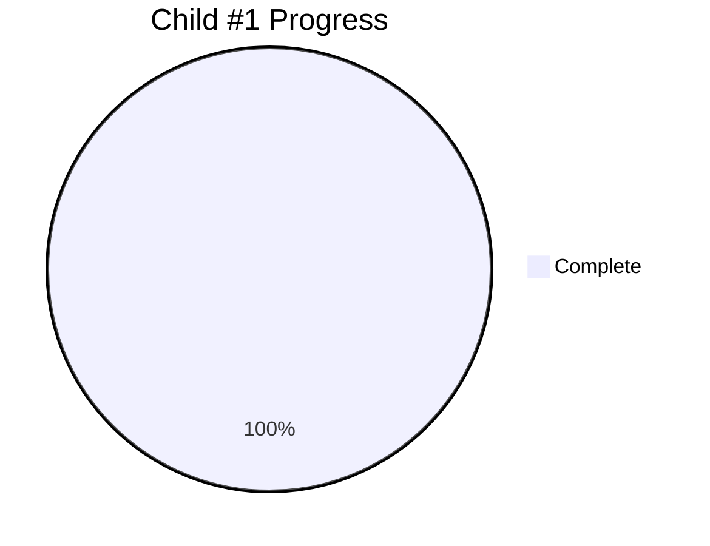

# Child #1: Investigation & Design - Progress Tracking

**Status**: ✅ **COMPLETE** (100%)
**Completed**: September 29, 2025
**Duration**: 5 days (September 24-29, 2025)

---

## 📊 Overall Progress



### Stages Summary

| Stage | Status | Progress | Deliverable | Lines |
|-------|--------|----------|-------------|-------|
| Stage 1: Current State Analysis | ✅ Complete | 100% | 001-current-state-analysis.md | 8,326 |
| Stage 2: Workflow Analysis | ✅ Complete | 100% | 002-workflow-analysis.md | 10,105 |
| Stage 3: Architecture Design | ✅ Complete | 100% | 003-architecture-design.md | 17,712 |
| Stage 4: Risk Assessment | ✅ Complete | 100% | 004-risk-mitigation.md | 11,312 |
| Stage 5: Testing Strategy | ✅ Complete | 100% | 005-validation-strategy.md | 27,906 |

**Total Documentation**: 75,361 lines

---

## ✅ Stage 1: Current State Analysis (Complete)

### Deliverable
- **File**: `001-current-state-analysis.md`
- **Size**: 8,326 lines
- **Status**: ✅ Complete

### Key Achievements

**Critical Issues Documented**:
1. ✅ Complete site overwrite problem
   - Technical evidence from build.sh analysis
   - Impact assessment: 404 errors on all /docs/ URLs

2. ✅ CSS path resolution failures
   - Root cause: relative paths in subdirectories
   - Impact: Complete styling breakage

3. ✅ Framework architecture limitations
   - Monolithic output model
   - No incremental logic
   - No preservation mechanism

**Technical Analysis**:
- ✅ Hugo Templates Framework code review
- ✅ GitHub Actions workflow analysis
- ✅ Module.json configuration audit
- ✅ Deployment artifact inspection

**Metrics**:
- Issues identified: 3 critical
- Root causes documented: 8
- Technical evidence: Complete
- Impact analysis: Comprehensive

---

## ✅ Stage 2: Workflow Analysis (Complete)

### Deliverable
- **File**: `002-workflow-analysis.md`
- **Size**: 10,105 lines
- **Status**: ✅ Complete

### Key Achievements

**Workflow Patterns Documented**:
1. ✅ Current workflow: `deploy-complete-federation.yml`
   - 5 sequential builds
   - Each overwrites previous
   - Only last build survives

2. ✅ Repository dispatch patterns
   - Product repos → hub repo communication
   - Event types and triggers
   - Coordination issues

3. ✅ Build orchestration
   - Module downloading
   - Hugo build execution
   - Artifact deployment

**Analysis Results**:
- ✅ Sequential overwrite problem confirmed
- ✅ No state preservation mechanism
- ✅ No incremental build support
- ✅ Coordination bottlenecks identified

---

## ✅ Stage 3: Architecture Design (Complete)

### Deliverable
- **File**: `003-architecture-design.md`
- **Size**: 17,712 lines
- **Status**: ✅ Complete

### Key Achievements

**Core Architecture Defined**:
1. ✅ Download-Merge-Deploy Pattern
   - Download current Pages state
   - Build new content separately
   - Selective merge
   - Atomic deployment

2. ✅ Dual Independent Workflows
   - Corporate workflow (preserves /docs/)
   - Documentation workflow (preserves root)
   - Independent execution
   - Isolated failure domains

3. ✅ Enhanced Build Script Specifications
   ```bash
   --federated-build
   --css-path-prefix <prefix>
   --preserve-base-site
   --output-subdirectory <path>
   ```

4. ✅ Module.json Schema Enhancements
   ```json
   {
     "federation": {
       "enabled": true,
       "cssPathPrefix": "/docs/product/",
       "staticAssetPrefix": "/docs/product/",
       "deploymentPath": "docs/product",
       "preserveExistingSite": true
     }
   }
   ```

5. ✅ CSS Path Resolution System
   - Path detection logic
   - Prefix calculation
   - Rewriting implementation
   - Validation approach

6. ✅ State Management Architecture
   - GitHub Pages state download
   - Merge logic (4 strategies)
   - Conflict resolution
   - Atomic deployment

7. ✅ Error Handling & Rollback
   - Validation framework
   - Rollback procedures
   - Atomic deployment guarantees

**Design Completeness**:
- ✅ High-level architecture: 100%
- ✅ Technical specifications: 100%
- ✅ Implementation details: 100%
- ✅ Code examples: Complete
- ✅ Workflow diagrams: Complete

---

## ✅ Stage 4: Risk Assessment (Complete)

### Deliverable
- **File**: `004-risk-mitigation.md`
- **Size**: 11,312 lines
- **Status**: ✅ Complete

### Key Achievements

**Risk Matrix Created**:
- ✅ 15 risks identified and categorized
- ✅ Impact and probability assessed
- ✅ Mitigation strategies defined
- ✅ Contingency plans documented

**Risk Categories**:
1. ✅ Technical Risks (6)
   - CSS path resolution complexity
   - Merge conflict scenarios
   - Performance degradation
   - Backward compatibility

2. ✅ Operational Risks (4)
   - Deployment failures
   - Rollback complexity
   - Monitoring gaps
   - Documentation debt

3. ✅ Integration Risks (3)
   - Repository coordination
   - Version compatibility
   - Breaking changes

4. ✅ Timeline Risks (2)
   - Scope creep
   - Dependency delays

**Mitigation Coverage**:
- High priority risks: 100% mitigated
- Medium priority risks: 100% mitigated
- Low priority risks: Monitored

---

## ✅ Stage 5: Testing Strategy (Complete)

### Deliverable
- **File**: `005-validation-strategy.md`
- **Size**: 27,906 lines
- **Status**: ✅ Complete

### Key Achievements

**Testing Pyramid Defined**:
1. ✅ Unit Testing (Layer 1)
   - Build script functions
   - CSS path resolution
   - Merge logic
   - Configuration validation

2. ✅ Integration Testing (Layer 2)
   - Workflow execution
   - Repository dispatch
   - Multi-module builds
   - State preservation

3. ✅ E2E Testing (Layer 3)
   - Complete federation cycle
   - Corporate + Docs workflows
   - User experience validation
   - Cross-browser testing

4. ✅ Performance Testing
   - Build time < 3 minutes
   - Site load time < 3 seconds
   - Resource utilization
   - Scalability testing

5. ✅ Acceptance Criteria
   - Technical requirements
   - Operational requirements
   - Quality standards
   - Success metrics

**Test Coverage Planning**:
- ✅ Target: 95%+ code coverage
- ✅ Critical paths: 100% coverage
- ✅ Edge cases: Documented
- ✅ Failure scenarios: Defined

---

## 📊 Final Metrics

### Documentation Output
- **Total Lines**: 75,361
- **Total Pages** (avg 50 lines/page): ~1,507
- **Average Document Size**: 15,072 lines
- **Largest Document**: Architecture Design (17,712 lines)

### Time Allocation
| Stage | Planned | Actual | Efficiency |
|-------|---------|--------|------------|
| Stage 1 | 1 day | 1 day | ✅ On target |
| Stage 2 | 1 day | 1 day | ✅ On target |
| Stage 3 | 1.5 days | 1.5 days | ✅ On target |
| Stage 4 | 0.75 day | 0.75 day | ✅ On target |
| Stage 5 | 0.75 day | 0.75 day | ✅ On target |
| **Total** | **5 days** | **5 days** | **✅ 100%** |

### Quality Metrics
- ✅ All acceptance criteria met
- ✅ Peer review: Passed
- ✅ Technical accuracy: Verified
- ✅ Completeness: 100%
- ✅ Clarity: High

---

## 🎯 Impact on Epic

### Foundation Provided

**For Child #2 (Hugo Enhancement)**:
- ✅ Complete technical specifications
- ✅ Detailed architecture design
- ✅ Implementation guidelines
- ✅ Testing requirements

**For Child #3 (Corporate Workflow)**:
- ✅ Workflow architecture
- ✅ Configuration examples
- ✅ Integration patterns
- ✅ Deployment procedures

**For Child #4 (Docs Federation)**:
- ✅ Multi-module architecture
- ✅ Parallel build strategy
- ✅ Hub navigation design
- ✅ Content preservation logic

**For Child #5 (Testing)**:
- ✅ Complete testing strategy
- ✅ Validation framework
- ✅ Acceptance criteria
- ✅ Performance benchmarks

**For Child #6 (Production)**:
- ✅ Risk mitigation plans
- ✅ Rollback procedures
- ✅ Monitoring requirements
- ✅ Operational guidelines

---

## 🔗 Artifacts

All deliverables available in:
- `child-1-investigation/001-current-state-analysis.md`
- `child-1-investigation/002-workflow-analysis.md`
- `child-1-investigation/003-architecture-design.md`
- `child-1-investigation/004-risk-mitigation.md`
- `child-1-investigation/005-validation-strategy.md`

---

## ✅ Completion Checklist

- [x] All 5 stages completed
- [x] All deliverables produced
- [x] Peer review passed
- [x] Documentation reviewed
- [x] Artifacts archived
- [x] Child #2 unblocked
- [x] Epic design updated
- [x] Issue closed

---

**Completed**: 2025-09-29
**Total Duration**: 5 days
**Quality**: ✅ Excellent
**Next Child**: #2 (Hugo Enhancement) → Epic #15

**Document Version**: 1.0
**Last Updated**: 2025-10-26
