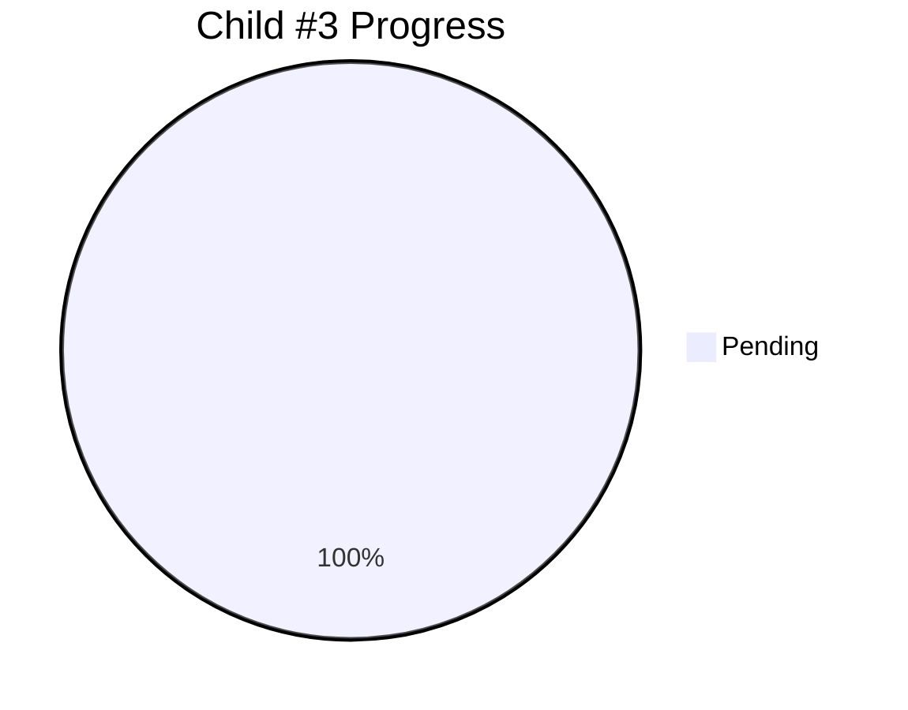

# Child #3: Corporate Site Incremental Workflow - Progress Tracking

**Status**: ⏳ Ready to start
**Started**: Not yet started
**Estimated Duration**: ~3 days

---

## 📊 Overall Progress

### Stages Summary

| Stage | Status | Progress | Deliverable |
|-------|--------|----------|-------------|
| Stage 1: Workflow YAML Creation | ⏳ Pending | 0% | deploy-corporate-incremental.yml |
| Stage 2: Configuration Files | ⏳ Pending | 0% | corporate-modules.json |
| Stage 3: Repository Dispatch | ⏳ Pending | 0% | notify-hub.yml |
| Stage 4: Testing & Validation | ⏳ Pending | 0% | Test report |

---

## 🎯 Ready to Start

**Prerequisites Met**:
- ✅ Child #1 (Investigation) complete
- ✅ Child #2 (Epic #15) complete
- ✅ Detailed design created
- ✅ Architecture defined

**Next Action**: Create Stage 1 implementation plan (001-workflow-creation.md)

---

**Created**: 2025-10-26
**Status**: Awaiting implementation
**Document Version**: 1.0
