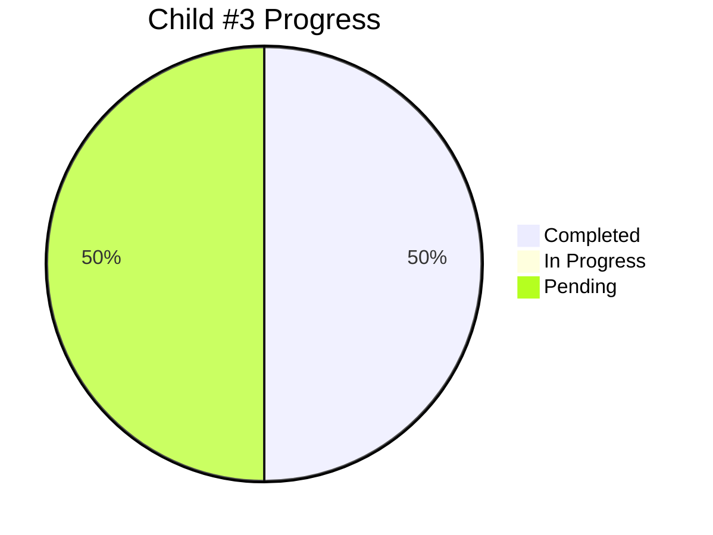

# Child #3: Corporate Site Incremental Workflow - Progress Tracking

**Status**: 🔄 In Progress (Stage 2 Complete)
**Started**: 2025-10-26
**Last Updated**: 2025-10-27
**Duration**: 1 day elapsed

---

## 📊 Overall Progress

### Stages Summary

| Stage | Status | Progress | Deliverable | Completed |
|-------|--------|----------|-------------|-----------|
| Stage 1: Workflow YAML Creation | ✅ Complete | 100% | deploy-corporate-incremental.yml | 2025-10-26 |
| Stage 2: Configuration Files | ✅ Complete | 100% | corporate-modules.json | 2025-10-27 |
| Stage 3: Repository Dispatch | ⏳ Pending | 0% | notify-hub.yml integration | - |
| Stage 4: Testing & Validation | ⏳ Pending | 0% | Test report (all scenarios) | - |

**Overall**: 2/4 stages complete (50%)

---

## ✅ Completed Stages

### Stage 1: Workflow YAML Creation
- **Duration**: < 1 hour
- **Deliverable**: `.github/workflows/deploy-corporate-incremental.yml` (270 lines)
- **Key Features**:
  - Download-Merge-Deploy pattern implementation
  - rsync-based selective merge with /docs/ preservation
  - Comprehensive error handling and logging
  - Debug mode support
  - Fallback /docs/index.html creation

### Stage 2: Configuration Files
- **Completed**: 2025-10-27
- **Duration**: < 30 minutes
- **Deliverable**: `configs/corporate-modules.json` (746 bytes)
- **Validation**: ✅ All 9 validation checks passed
- **Key Achievements**:
  - JSON syntax validated (automated)
  - Configuration values verified (preserve-base-site strategy)
  - module.json verified in info-tech repository
  - All required fields present and correct
- **Details**: See [002-progress.md](002-progress.md)

---

## ⏳ Pending Stages

### Stage 3: Repository Dispatch Integration
- **Status**: Not started
- **Objective**: Setup automated triggers from info-tech repository
- **Tasks**: Create/verify notify-hub.yml workflow integration
- **Details**: See [003-repository-dispatch.md](003-repository-dispatch.md)

### Stage 4: Testing & Validation
- **Status**: Not started
- **Objective**: Comprehensive E2E testing of workflow
- **Tasks**: Test all scenarios (fresh deploy, incremental, errors)
- **Details**: See [004-testing-validation.md](004-testing-validation.md)

---

## 📈 Progress Details

### Completed Work
- ✅ **Stage 1**: Workflow YAML with Download-Merge-Deploy pattern (270 lines)
- ✅ **Stage 2**: Configuration files validated (9/9 checks passed)

### Next Steps
1. Implement Stage 3: Repository Dispatch Integration
2. Implement Stage 4: Testing & Validation
3. Document final results and close Child #3

---

**Created**: 2025-10-26
**Last Updated**: 2025-10-27
**Status**: 🔄 50% Complete (2/4 stages)
**Document Version**: 4.0
