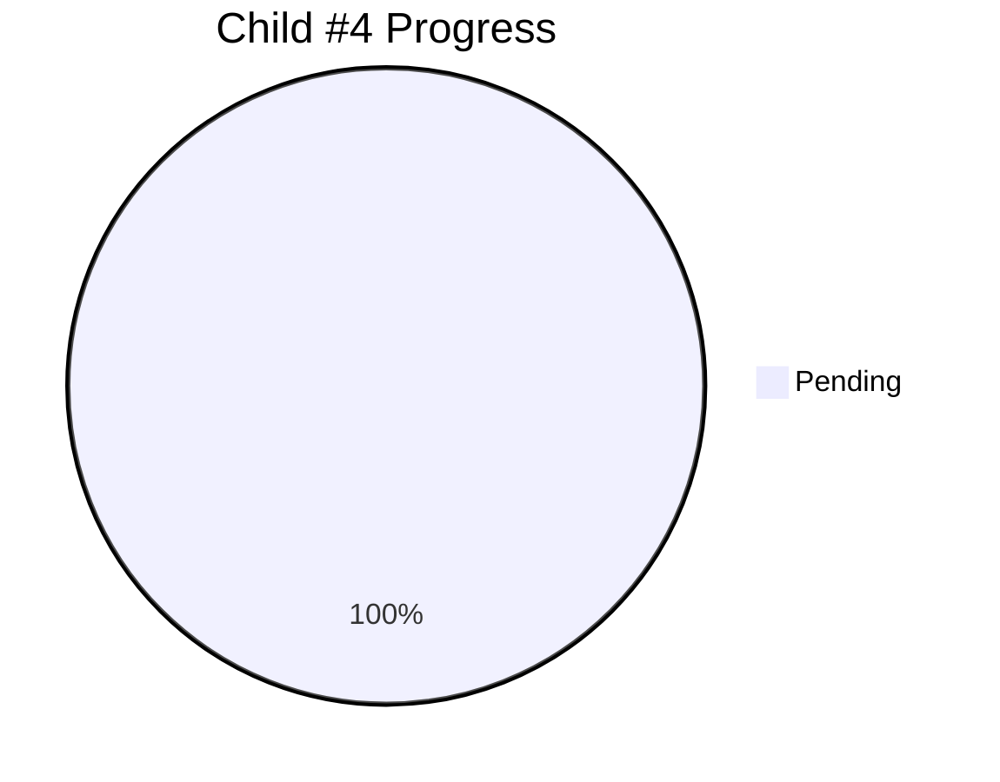

# Child #4: Documentation Federation Workflow - Progress Tracking

**Status**: ⏳ Pending
**Blocked By**: Child #3 (Corporate Workflow)
**Estimated Duration**: ~4 days

---

## 📊 Overall Progress

---

## 🚧 Blocked

**Reason**: Waiting for Child #3 (Corporate Workflow) to complete

**Why**: Child #3 provides:
- Working workflow template
- Proven Download-Merge-Deploy pattern
- Repository dispatch integration example
- Preservation logic validation

**Next Action**: Will start after Child #3 completion and review

---

**Created**: 2025-10-26
**Status**: Design complete, awaiting unblock
**Document Version**: 1.0
