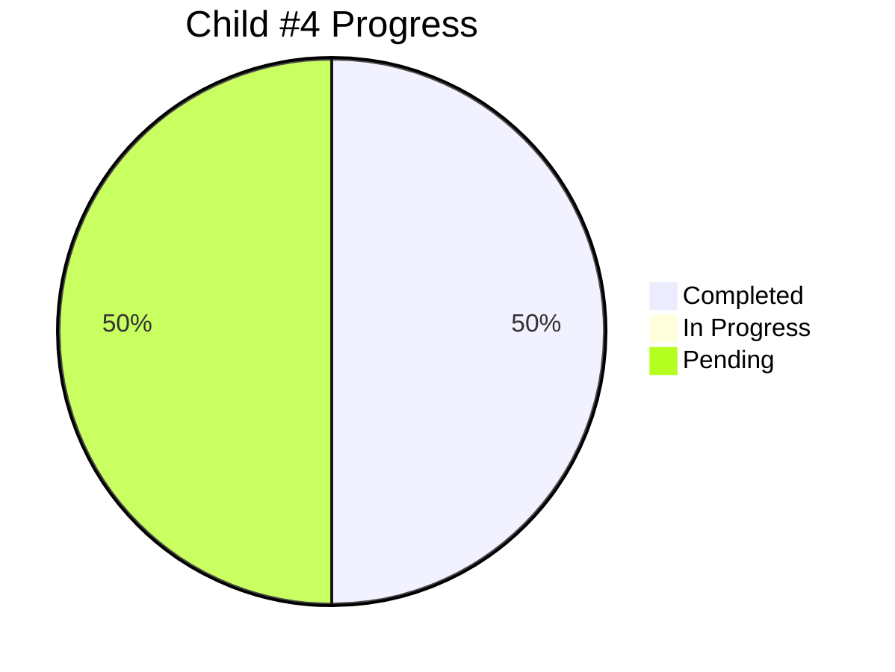

# Child #4: Documentation Federation Workflow - Progress Tracking

**Status**: 🔄 In Progress (50% Complete)
**Started**: 2025-10-26
**Estimated Duration**: ~4 days (2 days elapsed)

---

## 📊 Overall Progress

---

## 📋 Stages Summary

| Stage | Status | Progress | Started | Completed | Duration |
|-------|--------|----------|---------|-----------|----------|
| Stage 1: Workflow YAML | ✅ Complete | 100% | Oct 26 | Oct 26 | < 1 hour |
| Stage 2: Configuration | ✅ Complete | 100% | Oct 26 | Oct 26 | < 30 min |
| Stage 3: Documentation Hub | ⏳ Pending | 0% | - | - | ~0.5 days |
| Stage 4: Repository Dispatch | ⏳ Pending | 0% | - | - | ~1 day |

**Overall**: 2/4 stages complete (50%)

---

## ✅ Completed Work

### Stage 1: Workflow YAML Creation (✅ 100%)
**Deliverable**: `.github/workflows/deploy-docs-federation.yml` (385 lines)
**Commit**: 23b9578

**Features**:
- 4 repository_dispatch event types + manual trigger
- Parallel repository cloning (4 products)
- Federated build integration
- Documentation hub placeholder
- Selective merge preserving corporate root
- Comprehensive validation and error handling

**Key Achievements**:
- All 9 planned tasks implemented
- Based on proven Child #3 pattern
- Ready for testing

### Stage 2: Configuration Files (✅ 100%)
**Deliverable**: `configs/documentation-modules.json` (104 lines)
**Commit**: 23b9578

**Configuration**:
- 4 product modules configured (quiz, hugo-templates, web-terminal, info-tech-cli)
- Parallel builds enabled (max 4 concurrent)
- CSS path prefixes set for all modules
- preserve-base-site strategy
- fail_fast=false for resilience

**Notes**:
- Product module.json verification deferred to testing phase
- Configuration follows Epic #15 schema

---

## 🔄 Current Status

**Current Phase**: Implementation complete for Stages 1 & 2

**Next Steps**:
1. **Option A - Testing First** (Recommended):
   - Test workflow with manual trigger
   - Verify product builds work
   - Validate configuration
   - Then proceed to Stage 3 enhancements

2. **Option B - Complete Stages First**:
   - Implement Stage 3 (Documentation Hub enhancement)
   - Implement Stage 4 (Repository Dispatch)
   - Then test all together

---

## ⏳ Pending Work

### Stage 3: Documentation Hub Creation (0%)
**Objective**: Enhance documentation hub with professional design

**Planned Tasks**:
- Replace placeholder hub with full HTML/CSS/JS template
- Add search functionality
- Create hub generation script
- Add product status badges (optional)
- Test locally

**Estimated Duration**: 0.5 days

### Stage 4: Repository Dispatch Integration (0%)
**Objective**: Setup automated triggers from all product repositories

**Planned Tasks**:
- Create notify workflows in 4 product repos
- Setup GitHub tokens
- Test repository dispatch
- E2E testing
- Smart deployment logic (optional)

**Estimated Duration**: 1 day

---

## 📈 Metrics

- **Lines of Code**: 489 (workflow 385 + config 104)
- **Lines of Documentation**: 1,873 (stage plans)
- **Time Spent**: ~1.5 hours
- **Stages Complete**: 2/4 (50%)
- **On Schedule**: Yes (faster than estimated)

---

## 🎯 Success Criteria Progress

- ✅ Multi-product workflow created
- ✅ Parallel builds configured
- ⏳ Documentation Hub with navigation (placeholder exists)
- ✅ Each product deploys to `/docs/{product}/`
- ✅ Corporate site preservation logic
- ✅ CSS path prefixes configured
- ⏳ Build time < 3 minutes (pending test)
- ⏳ Repository dispatch working (pending Stage 4)

**Met**: 5/8 criteria (63%)

---

## 🔗 Related Links

- **Child Issue**: [#6 - Documentation Federation Workflow](https://github.com/info-tech-io/info-tech-io.github.io/issues/6)
- **Epic**: [#2 - Rebuild GitHub Pages Federation](https://github.com/info-tech-io/info-tech-io.github.io/issues/2)
- **Implementation Commit**: [23b9578](https://github.com/info-tech-io/info-tech-io.github.io/commit/23b9578)

---

**Created**: 2025-10-26
**Last Updated**: 2025-10-26
**Status**: Stages 1 & 2 complete, testing or Stage 3 next
**Document Version**: 2.0
