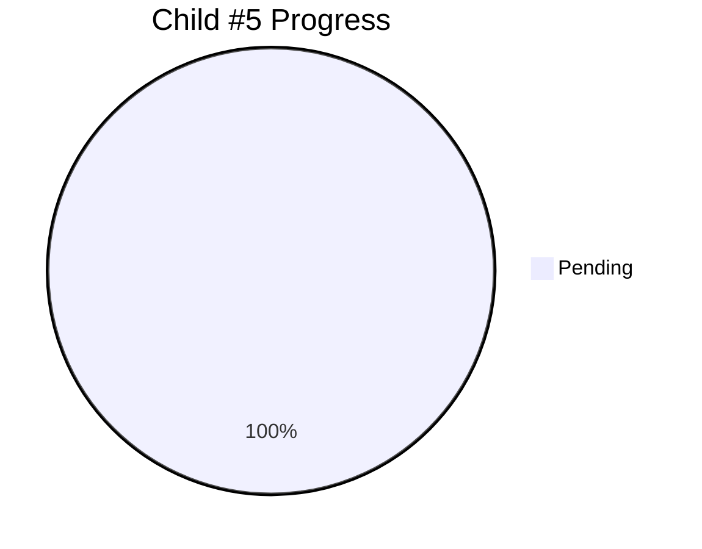

# Child #5: Integration Testing & Validation - Progress Tracking

**Status**: ⏳ Pending
**Blocked By**: Child #3, Child #4
**Estimated Duration**: ~2 days

---

## 📊 Overall Progress

---

## 🚧 Blocked

**Reason**: Waiting for both workflows to be implemented

**Dependencies**:
- ⏳ Child #3 (Corporate Workflow) - Must be complete
- ⏳ Child #4 (Docs Federation) - Must be complete

**What's Needed**:
- Working corporate workflow
- Working documentation workflow
- Both workflows deployed to staging/test environment

**Next Action**: Will start after Child #3 AND Child #4 completion

---

**Created**: 2025-10-26
**Status**: Design complete, awaiting unblock
**Document Version**: 1.0
