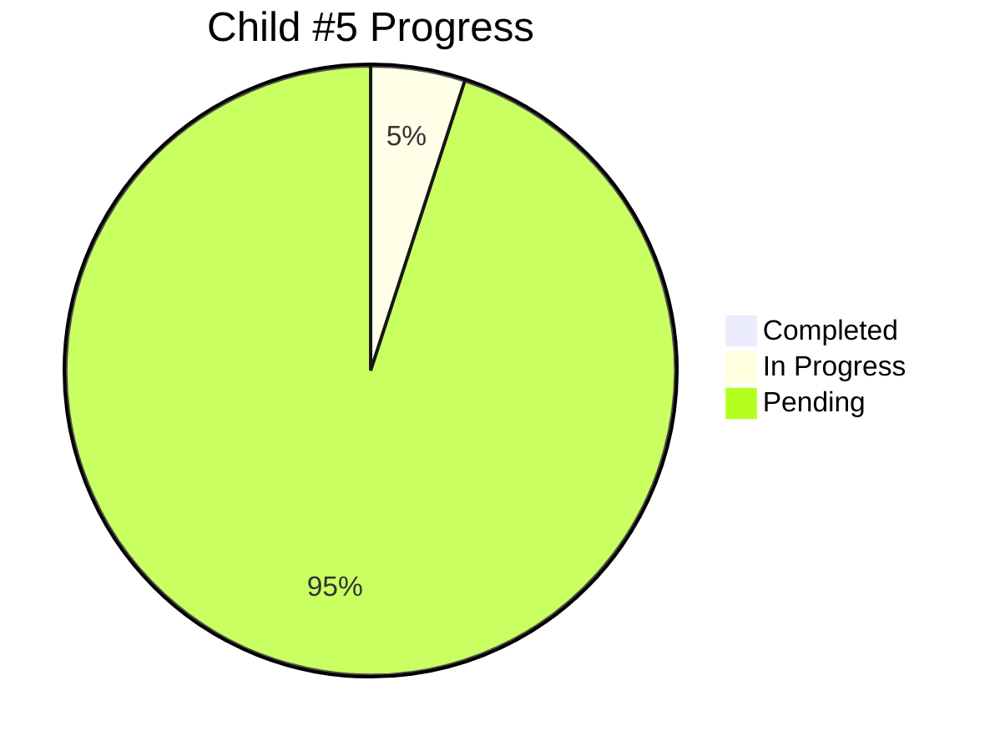

# Child #5: Integration Testing & Validation - Progress Tracking

**Status**: 🔄 In Progress
**Started**: 2025-10-28
**Estimated Duration**: ~2.25 days

---

## 📊 Overall Progress

**Current Stage**: Stage 1 - Environment & Prerequisites

---

## ✅ Unblocked

**Date**: 2025-10-28

**Dependencies Resolved**:
- ✅ Child #3 (Corporate Workflow) - Complete
- ✅ Child #4 (Docs Federation) - Complete

**What's Available**:
- Working corporate workflow (`.github/workflows/deploy-corporate-incremental.yml`)
- Working documentation workflow (`.github/workflows/deploy-docs-federation.yml`)
- Production deployment at https://info-tech-io.github.io

**Current Action**: Executing Stage 1 - Environment & Prerequisites

---

## 🎯 Stage Status

| Stage | Status | Progress | Notes |
|-------|--------|----------|-------|
| Stage 1: Environment Setup | 🔄 In Progress | 0% | Started 2025-10-28 |
| Stage 2: E2E Testing | ⏳ Pending | 0% | Awaiting Stage 1 |
| Stage 3: Integration Testing | ⏳ Pending | 0% | - |
| Stage 4: UX Validation | ⏳ Pending | 0% | - |
| Stage 5: Performance | ⏳ Pending | 0% | - |
| Stage 6: Reliability | ⏳ Pending | 0% | - |
| Stage 7: Results Documentation | ⏳ Pending | 0% | - |

---

**Created**: 2025-10-26
**Updated**: 2025-10-28
**Status**: Stage 1 in progress
**Document Version**: 1.1
