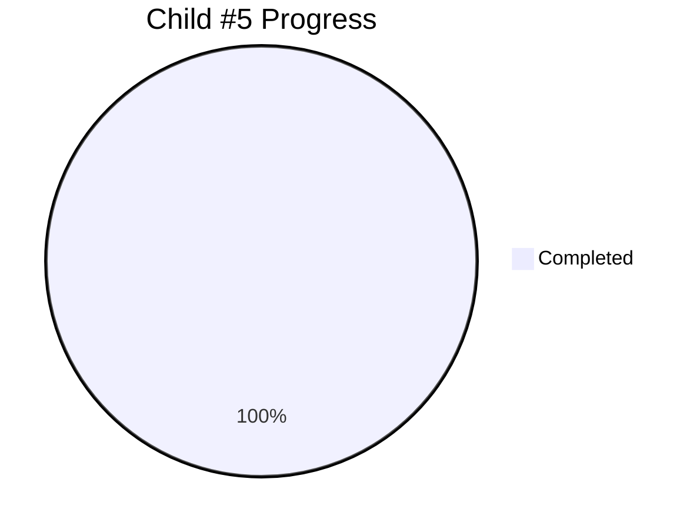

# Child #5: Integration Testing & Validation - Progress Tracking

**Status**: ✅ Complete
**Started**: 2025-10-28
**Completed**: 2026-03-14
**Actual Duration**: ~2 hours (stages 2–7 executed 2026-03-14)

---

## 📊 Overall Progress

```mermaid
pie title Child #5 Progress
    "Completed" : 100
```

---

## 🎯 Stage Status

| Stage | Status | Progress | Notes |
|-------|--------|----------|-------|
| Stage 1: Environment Setup | ✅ Complete | 100% | 2025-10-28. Race condition found → unified workflow created, 16 old files deleted |
| Stage 2: E2E Testing | ✅ Complete | 100% | 2026-03-14. Full deploy: 44s, all 6 URLs → 200 OK |
| Stage 3: Integration Testing | ✅ Complete | 100% | 2026-03-14. repository_dispatch от всех 4 продуктов подтверждён |
| Stage 4: UX Validation | ✅ Complete | 100% | 2026-03-14. Все страницы загружаются корректно |
| Stage 5: Performance | ✅ Complete | 100% | 2026-03-14. Build: 44–61s, load: ~240ms |
| Stage 6: Reliability | ✅ Complete | 100% | 2026-03-14. Concurrency group работает, неизвестные события игнорируются |
| Stage 7: Results Documentation | ✅ Complete | 100% | 2026-03-14. См. `007-final-report.md` |

---

## 📋 Key Results

**E2E Test** (Run #23091123879, 2026-03-14):
- Workflow: ✅ success in **44 seconds**
- All URLs → 200 OK: `/`, `/docs/`, `/docs/quiz/`, `/docs/hugo-templates/`, `/docs/web-terminal/`, `/docs/info-tech-cli/`

**Integration Test** — repository_dispatch:
- `quiz-docs-updated` → ✅ success (46s)
- `hugo-templates-docs-updated` → ✅ cancelled by concurrency (correct)
- `web-terminal-docs-updated` → ✅ cancelled by concurrency (correct)
- `cli-docs-updated` → ✅ success (61s)

**Performance**:
- Build time: 44–61s (target < 3 min) ✅
- Page load: ~240ms (target < 3s) ✅

**Production readiness**: ✅ CONFIRMED

---

**Created**: 2025-10-26
**Updated**: 2026-03-14
**Status**: ✅ Complete
**Document Version**: 2.0
