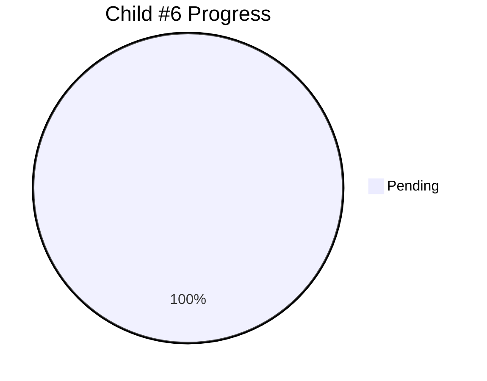

# Child #6: Production Deployment & Monitoring - Progress Tracking

**Status**: ⏳ Pending
**Blocked By**: Child #5 (Testing & Validation)
**Estimated Duration**: ~2 days

---

## 📊 Overall Progress

---

## 🚧 Blocked

**Reason**: Waiting for complete testing validation

**Dependencies**:
- ⏳ Child #3 (Corporate Workflow) - Must be complete
- ⏳ Child #4 (Docs Federation) - Must be complete
- ⏳ Child #5 (Testing) - MUST be complete with ALL tests passing

**What's Needed**:
- All E2E tests passing
- Performance validation complete
- User experience validated
- Reliability confirmed
- Test report reviewed and approved

**Next Action**: Will start only after Child #5 100% complete and approved

---

**Created**: 2025-10-26
**Status**: Design complete, awaiting unblock
**Document Version**: 1.0
