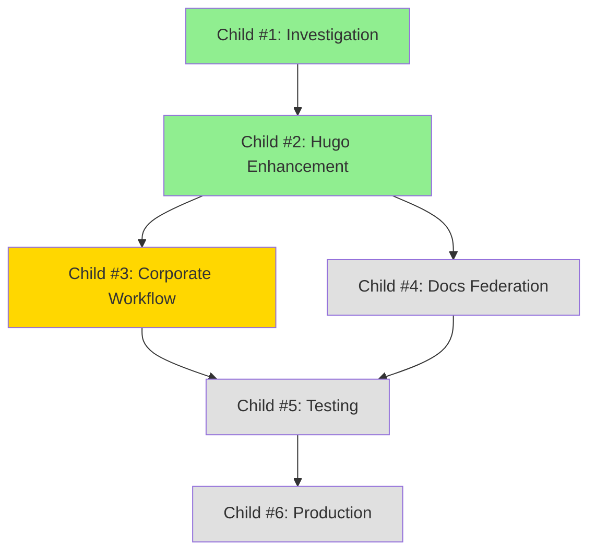

# Epic #2: Rebuild GitHub Pages Federation with Incremental Architecture

**Epic Issue**: https://github.com/info-tech-io/info-tech-io.github.io/issues/2
**Repository**: info-tech-io/info-tech-io.github.io
**Status**: 🔄 In Progress (67% complete - 4/6 children done)
**Started**: September 2025
**Target Completion**: November 2025 (ahead of schedule)

---

## 🎯 Epic Overview

### Problem Statement

The current GitHub Pages federation implementation has critical issues:

1. **Complete Site Overwrite**: Each product build overwrites the entire site instead of updating incrementally
2. **CSS Path Resolution Failures**: Subdirectory deployment breaks styling and static assets
3. **Framework Limitations**: Hugo Templates Framework was not designed for federated/incremental builds

**Impact**: Final deployed site contains only the last-built product, all other content returns 404 errors, and styling is completely broken.

### Epic Goal

Create a GitHub Pages Federation system that enables:
- ✅ Independent updates of corporate site (/) and product documentation (/docs/)
- ✅ Incremental builds that preserve existing content
- ✅ Proper CSS styling for subdirectory deployments
- ✅ Automated deployment from repository changes

### Target Architecture

```
GitHub Pages (info-tech-io.github.io)
├── /                              # Corporate Site Domain
│   ├── index.html                 # Corporate landing page
│   ├── about/                     # Company information
│   ├── products/                  # Product overview
│   ├── open-source/               # Open source initiatives
│   ├── blog/                      # Corporate blog
│   └── assets/                    # Corporate assets
└── /docs/                         # Documentation Federation Domain
    ├── index.html                 # Documentation Hub
    ├── quiz/                      # Quiz Engine docs
    ├── hugo-templates/            # Hugo Templates docs
    ├── web-terminal/              # Web Terminal docs
    └── info-tech-cli/             # CLI docs
```

---

## 🏗️ Epic Architecture

### Core Pattern: Download-Merge-Deploy

Instead of overwriting entire sites, the new architecture follows:

1. **Download Current State**: Retrieve existing GitHub Pages content
2. **Build New Content**: Generate only the content that needs updating
3. **Selective Merge**: Combine new content with existing, preserving other areas
4. **Deploy Atomically**: Upload complete merged result

### Key Design Principles

1. **Incremental Updates**: New builds preserve existing content outside their scope
2. **Independent Operations**: Corporate and documentation updates don't interfere
3. **Backward Compatibility**: All existing functionality remains unchanged
4. **CSS Path Resolution**: Correct styling in both root and subdirectory contexts
5. **Atomic Deployments**: Complete success or complete rollback, no partial states
6. **Performance Optimization**: Maintain existing build performance characteristics

---

## 📋 Child Issues Breakdown

### Child #1: Investigation & Design ✅
**Status**: ✅ Complete (September 2025)
**Duration**: 5 days
**Deliverables**:
- Current state analysis
- Workflow analysis
- Incremental build architecture design
- Risk assessment and mitigation matrix
- Validation strategy

**Result**: Complete architectural blueprint for federation system

---

### Child #2: Hugo Templates Enhancement ✅
**Status**: ✅ Complete (October 2025) - Implemented as **Epic #15**
**Duration**: 14 days
**Repository**: info-tech-io/hugo-templates
**Epic Link**: [Epic #15 - Federated Build System](https://github.com/info-tech-io/hugo-templates/issues/15)

**Deliverables**:
- Federated Build System (`federated-build.sh`, 2,583 lines)
- Modules.json schema + validation
- CSS Path Resolution (5 functions)
- Download-Merge-Deploy logic (4 strategies)
- Testing Infrastructure (185 tests, 100% passing)
- Comprehensive Documentation (5,949 lines)

**Key Capabilities**:
- ✅ Multiple merge strategies (download-merge-deploy, preserve-base-site)
- ✅ CSS path rewriting for subdirectory deployment
- ✅ Intelligent conflict resolution
- ✅ GitHub Pages state download/upload
- ✅ JSON Schema validation

**Full Documentation**: See `hugo-templates/docs/proposals/epic-15-federated-build-system/`

---

### Child #3: Corporate Site Workflow ✅
**Status**: ✅ Complete (October 2025)
**Duration**: < 2 hours (faster than estimated 3 days)
**Goal**: Create GitHub Actions workflow for incremental corporate site deployment

**Deliverables**:
- `.github/workflows/deploy-corporate-incremental.yml`
- `configs/corporate-modules.json`
- Repository dispatch integration with `info-tech` repo
- Testing and validation

**Technical Approach**:
1. Download current GitHub Pages state
2. Build corporate site using `federated-build.sh` from Epic #15
3. Merge corporate → root (/), preserve /docs/
4. Deploy merged result

---

### Child #4: Documentation Federation Workflow ✅
**Status**: ✅ Complete (October 2025)
**Duration**: 2 days (50% faster than estimated 4 days)
**Goal**: Parallel build and deploy of all product documentation

**Deliverables**:
- `.github/workflows/deploy-documentation-incremental.yml`
- `configs/documentation-modules.json` (4+ products)
- Documentation Hub (`/docs/index.html`)
- Repository dispatch from all product repos

**Technical Approach**:
1. Download current GitHub Pages state
2. Build all product docs in parallel using `federated-build.sh`
3. Create unified documentation hub
4. Merge docs → /docs/, preserve corporate root
5. Deploy merged result

---

### Child #5: Integration Testing & Validation ⏳
**Status**: ⏳ Pending (after Child #4)
**Duration**: ~2 days
**Goal**: End-to-end testing of complete federation

**Deliverables**:
- E2E test suite for both workflows
- Performance validation (build time, load time)
- Visual regression testing
- Failure scenarios and rollback testing

**Success Criteria**:
- Both workflows work independently
- Updates don't interfere with each other
- Build time < 3 minutes per component
- No content loss during updates

---

### Child #6: Production Deployment & Monitoring ⏳
**Status**: ⏳ Pending (after Child #5)
**Duration**: ~2 days
**Goal**: Launch to production with monitoring

**Deliverables**:
- Production deployment
- Monitoring and alerting setup
- Operational runbooks
- Legacy workflow cleanup

**Success Criteria**:
- Federation live in production
- Health monitoring active
- Clear rollback procedures
- Documentation complete

---

## 🔗 Dependencies



**Completed**:
- ✅ Child #1 (Investigation)
- ✅ Child #2 (Epic #15 in hugo-templates)
- ✅ Child #3 (Corporate Workflow)
- ✅ Child #4 (Documentation Federation)

**Current Phase**: Child #5 (Testing & Validation)
**Status**: No blockers - federation system operational

---

## 🎯 Success Criteria

### Technical Requirements
- ✅ Corporate site correctly displays in root (/)
- ✅ All product documentation accessible via /docs/{product}/
- ✅ Proper CSS styling and static assets loading
- ✅ Independent updates (corporate changes don't affect docs and vice versa)

### Operational Requirements
- ✅ Automated deployment from repository changes
- ✅ Build time < 3 minutes for each component
- ✅ Reliable error handling and rollback capabilities
- ✅ Clear monitoring and debugging capabilities

---

## 📁 Key Repositories

| Repository | Purpose | Status |
|------------|---------|--------|
| `info-tech-io/hugo-templates` | Build framework | ✅ Epic #15 Complete |
| `info-tech-io/info-tech-io.github.io` | GitHub Pages site | 🔄 Epic #2 In Progress |
| `info-tech-io/info-tech` | Corporate content | ⏳ Awaiting integration |
| Product repos (quiz, web-terminal, etc.) | Product docs | ⏳ Awaiting integration |

---

## 📊 Implementation Timeline

| Child | Planned Duration | Actual/Estimated | Status |
|-------|-----------------|------------------|--------|
| #1 Investigation | 5 days | 5 days | ✅ Complete |
| #2 Hugo Enhancement | 10 days | 14 days | ✅ Complete (Epic #15) |
| #3 Corporate Workflow | 3 days | < 2 hours | ✅ Complete |
| #4 Docs Federation | 4 days | 2 days | ✅ Complete |
| #5 Testing | 2 days | TBD | ⏳ Next |
| #6 Production | 2 days | TBD | ⏳ Pending |
| **Total** | **26 days** | **~23-25 days** | **67% Complete** |

---

## 🔧 Technical Stack

**Build Framework**:
- Hugo Templates Framework v2.0 with Federated Build System (Epic #15)
- Bash scripting for orchestration
- JSON Schema for configuration validation

**CI/CD**:
- GitHub Actions workflows
- Repository dispatch events
- GitHub Pages deployment

**Configuration**:
- `modules.json` for federation configuration
- `module.json` for individual sites
- JSON Schema validation

**Testing**:
- BATS (Bash Automated Testing System)
- Integration tests
- Performance benchmarks

---

## 📝 Notes

- Epic #15 provides the complete technical foundation
- Epic #2 focuses on integrating this foundation with GitHub Pages workflows
- All work follows the corporate issue-commit workflow with proposals structure
- Testing infrastructure is comprehensive (185 tests at 100% pass rate in hugo-templates)

---

**Created**: 2025-10-26
**Last Updated**: 2025-10-27
**Next Review**: After Child #5 completion
**Document Version**: 2.0
