# Epic #2: GitHub Pages Federation - Progress Tracking

> **LATEST UPDATE (2025-10-27):** Child #4 (Documentation Federation) ✅ COMPLETE! Multi-product parallel builds deployed to production. All 4 products accessible at /docs/.
>
> **Progress:** 67% Complete (4/6 children done)

---

## 📊 Epic Overview

```mermaid
graph TB
    subgraph "Epic #2: GitHub Pages Federation"
        E[Epic Issue #2<br/>Rebuild GitHub Pages Federation]

        subgraph "Child Issues"
            C1[#3: Investigation & Design ✅]
            C2[#4: Hugo Enhancement ✅<br/>Epic #15 in hugo-templates]
            C3[#5: Corporate Workflow ✅]
            C4[#6: Docs Federation ✅]
            C5[#7: Testing & Validation ⏳]
            C6[#8: Production & Monitoring ⏳]
        end

        E --> C1
        E --> C2
        E --> C3
        E --> C4
        E --> C5
        E --> C6
    end

    style C1 fill:#90EE90,stroke:#006400
    style C2 fill:#90EE90,stroke:#006400
    style C3 fill:#90EE90,stroke:#006400
    style C4 fill:#90EE90,stroke:#006400
    style C5 fill:#FFD700,stroke:#FF8C00
    style C6 fill:#E0E0E0,stroke:#808080
```



---

## 🎯 Progress Status

### Epic Progress: 67% Complete (4/6 children complete)

| Child Issue | Status | Issue # | Duration | Progress | Dependencies |
|-------------|--------|---------|----------|---------|--------------|
| [#3] Investigation & Design | ✅ **COMPLETE** | [#3](https://github.com/info-tech-io/info-tech-io.github.io/issues/3) | 5 days | 100% | None |
| [#4] Hugo Enhancement | ✅ **COMPLETE** | [#4](https://github.com/info-tech-io/info-tech-io.github.io/issues/4) → [Epic #15](https://github.com/info-tech-io/hugo-templates/issues/15) | 14 days | 100% | #3 ✅ |
| [#5] Corporate Workflow | ✅ **COMPLETE** | [#5](https://github.com/info-tech-io/info-tech-io.github.io/issues/5) | < 2 hours | 100% | #4 ✅ |
| [#6] Docs Federation | ✅ **COMPLETE** | [#6](https://github.com/info-tech-io/info-tech-io.github.io/issues/6) | ~2 days | 100% | #5 ✅ |
| [#7] Testing & Validation | ⏳ **NEXT** | [#7](https://github.com/info-tech-io/info-tech-io.github.io/issues/7) | ~2 days | 0% | #5 ✅, #6 ✅ |
| [#8] Production & Monitoring | ⏳ **TODO** | [#8](https://github.com/info-tech-io/info-tech-io.github.io/issues/8) | ~2 days | 0% | #7 ✅ |

---

## 📈 Development Timeline

```mermaid
gantt
    title Epic #2 Timeline
    dateFormat  YYYY-MM-DD
    section Investigation
    Child #1: Investigation     :done, investigation, 2025-09-24, 5d
    section Foundation
    Child #2: Epic #15          :done, epic15, 2025-10-01, 14d
    section Workflows
    Child #3: Corporate         :done, corporate, 2025-10-26, 1d
    Child #4: Documentation     :done, docs, 2025-10-26, 2d
    section Quality
    Child #5: Testing           :testing, 2025-10-31, 2d
    section Launch
    Child #6: Production        :production, 2025-11-02, 2d
```

---

## 🔄 Workflow Visualization

### Current Development Phase: Child #5 (Testing & Validation) ⏳

```mermaid
stateDiagram-v2
    [*] --> Investigation
    Investigation --> HugoEnhancement: Child #1 Complete
    HugoEnhancement --> CorporateWorkflow: Child #2 Complete (Epic #15)
    CorporateWorkflow --> DocsWorkflow: Child #3 Complete
    DocsWorkflow --> Testing: Child #4 Complete
    Testing --> Production: Child #5 Complete
    Production --> [*]: Child #6 Complete

    note right of Investigation
        ✅ COMPLETED (Sep 2025)
        Duration: 5 days
        - Current state analysis
        - Workflow analysis
        - Architecture design
        - Risk assessment
        - Testing strategy
    end note

    note right of HugoEnhancement
        ✅ COMPLETED (Oct 2025)
        Duration: 14 days
        Implemented as Epic #15
        in hugo-templates repository
        - Federated build system
        - 185 tests (100% passing)
        - 5,949 lines of docs
    end note

    note right of CorporateWorkflow
        ✅ COMPLETED (Oct 26, 2025)
        Duration: < 2 hours
        - Workflow YAML created
        - modules.json configured
        - repository_dispatch verified
        - Incremental deploy tested
        - Production ready
    end note

    note right of DocsWorkflow
        ✅ COMPLETED (Oct 27, 2025)
        Duration: 2 days (50% faster)
        - Multi-product federation ✅
        - Parallel builds (4 products) ✅
        - Documentation hub (baseline) ✅
        - Production deployed ✅
    end note

    note right of Testing
        ⏳ NEXT (Oct 2025)
        Target: 2 days
        - E2E validation
        - Performance testing
        - Failure scenarios
    end note
```



---

## ✅ Completed Work Summary

### Child #1: Investigation & Design (100% Complete)

**Completed**: September 29, 2025
**Duration**: 5 days
**Status**: ✅ All deliverables complete

**Deliverables**:
- ✅ Current State Analysis (8,326 lines)
- ✅ Workflow Analysis (10,105 lines)
- ✅ Incremental Build Architecture Design (17,712 lines)
- ✅ Risk Mitigation Matrix (11,312 lines)
- ✅ Validation Strategy (27,906 lines)

**Total Documentation**: 75,361 lines

**Key Achievements**:
- Identified root causes of federation failures
- Designed Download-Merge-Deploy pattern
- Defined dual independent workflows strategy
- Created comprehensive risk assessment
- Established validation criteria

**Artifacts**:
- `docs/proposals/epic-2-github-pages-federation/child-1-investigation/`
  - `001-current-state-analysis.md`
  - `002-workflow-analysis.md`
  - `003-architecture-design.md`
  - `004-risk-mitigation.md`
  - `005-validation-strategy.md`
  - `design.md`
  - `progress.md`

---

### Child #2: Hugo Templates Enhancement (100% Complete)

**Completed**: October 20, 2025
**Duration**: 14 days
**Status**: ✅ All deliverables complete
**Implementation**: **Epic #15** in hugo-templates repository
**Epic Link**: https://github.com/info-tech-io/hugo-templates/issues/15

**Key Deliverables**:
1. **Federated Build System**
   - `scripts/federated-build.sh` (2,583 lines, 33 functions)
   - Modules.json configuration schema (298 lines)
   - JSON Schema validation

2. **CSS Path Resolution**
   - `detect_asset_paths()` - identifies relative paths
   - `calculate_css_prefix()` - computes prefix
   - `rewrite_asset_paths()` - rewrites HTML/CSS paths
   - `validate_rewritten_paths()` - validates correctness

3. **Download-Merge-Deploy Logic**
   - `download_existing_pages()` - GitHub Pages state download
   - `detect_merge_conflicts()` - conflict detection
   - `merge_with_strategy()` - 4 merge strategies
   - `merge_federation_output()` - final merge

4. **Testing Infrastructure**
   - 185 tests total (100% passing)
   - 78 Layer 1 tests (build.sh)
   - 82 Layer 2 tests (federated-build.sh)
   - 14 E2E Integration tests
   - 5 Performance tests

5. **Documentation**
   - 5,949 lines of comprehensive documentation
   - User guides, tutorials, API reference
   - Developer documentation
   - Migration resources

**Performance Metrics**:
- Single module build: ~1.2s (8x faster than target)
- 5-module federation: ~1.3s (46x faster than target)
- All tests passing at 100%

**Full Documentation**: See `hugo-templates/docs/proposals/epic-15-federated-build-system/progress.md`

---

### Child #3: Corporate Site Incremental Workflow (100% Complete)

**Completed**: October 26, 2025
**Duration**: < 2 hours
**Status**: ✅ Production ready

**Key Deliverables**:
1. **GitHub Actions Workflow**
   - `.github/workflows/deploy-corporate-incremental.yml` (270 lines)
   - Download-Merge-Deploy pattern implementation
   - rsync-based selective merge with /docs/ preservation
   - Comprehensive error handling and logging

2. **Configuration Files**
   - `configs/corporate-modules.json` (35 lines)
   - preserve-base-site strategy configured
   - Verified module.json in info-tech repository

3. **Repository Dispatch Integration**
   - Verified existing `notify-hub.yml` in info-tech repo
   - Uses `peter-evans/repository-dispatch@v3` action
   - Triggers on `docs/**` changes

4. **Testing & Validation**
   - Scenario 1 (Fresh Deployment): PASSED ✅
   - Workflow run 18817742026: SUCCESS in 58 seconds
   - All URLs verified (200 OK)
   - Performance: 58s (well under 3-minute target)

**Production Verification**:
- ✅ https://info-tech-io.github.io/ - Corporate site accessible
- ✅ https://info-tech-io.github.io/docs/ - Fallback page created
- ✅ /docs/ preservation logic functioning
- ✅ rsync selective merge working correctly

**Full Documentation**: See `docs/proposals/epic-2-github-pages-federation/child-3-corporate-workflow/`

---

### Child #4: Documentation Federation Workflow (100% Complete)

**Completed**: October 27, 2025
**Duration**: 2 days (50% faster than estimated 4 days)
**Status**: ✅ Complete - Issue #6 closed

**Key Deliverables**:
1. **GitHub Actions Workflow**
   - `.github/workflows/deploy-docs-federation.yml` (385 lines)
   - Multi-product parallel builds (4 products)
   - Download-Merge-Deploy pattern with /docs/ preservation
   - repository_dispatch + manual trigger support
   - Commit: 23b9578

2. **Configuration Files**
   - `configs/documentation-modules.json` (104 lines)
   - All 4 products configured: quiz, hugo-templates, web-terminal, info-tech-cli
   - Parallel builds enabled (max 4 concurrent)
   - All product module.json files verified ✅
   - Commit: 23b9578

3. **Documentation Hub (Baseline)**
   - Professional baseline hub at /docs/index.html
   - Grid layout with 4 product cards
   - Responsive design, modern CSS
   - Direct workflow integration (inline HTML)
   - Commit: 23b9578 (integrated)

4. **Repository Dispatch Integration**
   - Pre-existing notify workflows validated in all 4 repos
   - Bug fix: hugo-templates event-type mismatch corrected
   - All event types aligned with federation workflow
   - Commit: c49aae2 (hugo-templates repo)

5. **Production Deployment**
   - Workflow run 18822261191: SUCCESS ✅
   - Build time: 1m13s (61% under 3-minute target)
   - All 4 products accessible at /docs/{product}/
   - Corporate site preserved ✅
   - Live: https://info-tech-io.github.io/docs/

**All 4 Stages Complete**:
- Stage 1: Workflow YAML (< 1 hour)
- Stage 2: Configuration (< 30 min)
- Stage 3: Documentation Hub - Baseline (< 1 hour)
- Stage 4: Repository Dispatch - Validated + Fixed (< 30 min)

**Success Criteria Met**: 8/8 (100%)
- E2E testing appropriately deferred to Child #5

**Issue**: #6 - Closed ✅
**Documentation**: See `docs/proposals/epic-2-github-pages-federation/child-4-docs-federation/`
**Commits**: 23b9578, 654a6c4, 64df510, c49aae2

---

## 🚀 Next Steps

### Immediate Actions (Child #5)

**Goal**: Testing & Validation of complete federation system

**Tasks**:
1. ⏳ Review Child #5 proposal and requirements
2. ⏳ E2E testing of both workflows (corporate + docs)
3. ⏳ Performance validation (build times, load times)
4. ⏳ Test failure scenarios and rollback procedures
5. ⏳ Validate CSS styling across all pages
6. ⏳ Cross-browser and mobile testing
7. ⏳ Document findings and recommendations

**Estimated Duration**: 2 days

**Note**: Focus on system-level validation, not deep testing of individual components. Goal is to verify the federation architecture works as designed.

---

### Upcoming Children (Planning)

**Child #5: Testing & Validation** (2 days) - NEXT
- E2E validation of federation system
- Performance benchmarking
- Failure scenario testing
- Documentation of results

**Child #6: Production Deployment** (2 days)
- Final production launch
- Monitoring and alerting setup
- Operational runbooks
- Legacy workflow cleanup

---

## 📊 Metrics Dashboard

### Implementation Metrics

**Completed**:
- ✅ Investigation: 75,361 lines of design docs
- ✅ Hugo Enhancement: 2,583 lines of code + 5,949 lines of docs
- ✅ Testing: 185 tests at 100% pass rate
- ✅ Corporate Workflow: 270 lines (workflow + config)
- ✅ Docs Federation: 489 lines (workflow + config)

**Planned**:
- Child #5: ~500 lines (test suite + documentation)
- Child #6: ~200 lines (runbooks + monitoring)

### Time Tracking

| Metric | Planned | Actual | Variance |
|--------|---------|--------|----------|
| Child #1 | 5 days | 5 days | ✅ On target |
| Child #2 | 10 days | 14 days | +40% (acceptable for foundation) |
| Child #3 | 3 days | < 2 hours | -93% ✅ Faster |
| Child #4 | 4 days | 2 days | -50% ✅ Faster |
| Child #5 | 2 days | TBD | - |
| Child #6 | 2 days | TBD | - |
| **Total** | **26 days** | **~21 days + TBD** | **~25 days projected** |

### Quality Metrics

- ✅ Architecture documentation completeness: 100%
- ✅ Test coverage (Epic #15): 100%
- ✅ Backward compatibility: 100%
- ⏳ E2E validation: Pending Child #5

---

## 🔗 Quick Links

- **Epic Issue**: [#2 - Rebuild GitHub Pages Federation](https://github.com/info-tech-io/info-tech-io.github.io/issues/2)
- **Child Issues**: [#3](https://github.com/info-tech-io/info-tech-io.github.io/issues/3), [#4](https://github.com/info-tech-io/info-tech-io.github.io/issues/4), [#5](https://github.com/info-tech-io/info-tech-io.github.io/issues/5), [#6](https://github.com/info-tech-io/info-tech-io.github.io/issues/6), [#7](https://github.com/info-tech-io/info-tech-io.github.io/issues/7), [#8](https://github.com/info-tech-io/info-tech-io.github.io/issues/8)
- **Epic #15** (hugo-templates): [Federated Build System](https://github.com/info-tech-io/hugo-templates/issues/15)
- **Design Documentation**: [design.md](design.md)
- **Contributing Workflow**: [InfoTech.io Contributing Guide](https://github.com/info-tech-io/info-tech/blob/main/docs/content/open-source/issue-commit-workflow.md)

---

**Created**: 2025-10-26
**Last Updated**: 2025-10-27
**Next Review**: After Child #5 completion
**Document Version**: 2.0
