# Epic #2: GitHub Pages Federation - Progress Tracking

> **LATEST UPDATE (2025-10-26):** Epic restructured with proper proposals structure. Child #1 ✅ Complete, Child #2 ✅ Complete (Epic #15), Child #3 ⏳ Ready to start.
>
> **Progress:** 33% Complete (2/6 children done)

---

## 📊 Epic Overview

```mermaid
graph TB
    subgraph "Epic #2: GitHub Pages Federation"
        E[Epic Issue #2<br/>Rebuild GitHub Pages Federation]

        subgraph "Child Issues"
            C1[#3: Investigation & Design ✅]
            C2[#4: Hugo Enhancement ✅<br/>Epic #15 in hugo-templates]
            C3[#5: Corporate Workflow ⏳]
            C4[#6: Docs Federation ⏳]
            C5[#7: Testing & Validation ⏳]
            C6[#8: Production & Monitoring ⏳]
        end

        E --> C1
        E --> C2
        E --> C3
        E --> C4
        E --> C5
        E --> C6
    end

    style C1 fill:#90EE90,stroke:#006400
    style C2 fill:#90EE90,stroke:#006400
    style C3 fill:#FFD700,stroke:#FF8C00
    style C4 fill:#E0E0E0,stroke:#808080
    style C5 fill:#E0E0E0,stroke:#808080
    style C6 fill:#E0E0E0,stroke:#808080
```



---

## 🎯 Progress Status

### Epic Progress: 33% Complete (2/6 children complete)

| Child Issue | Status | Issue # | Duration | Progress | Dependencies |
|-------------|--------|---------|----------|---------|--------------|
| [#3] Investigation & Design | ✅ **COMPLETE** | [#3](https://github.com/info-tech-io/info-tech-io.github.io/issues/3) | 5 days | 100% | None |
| [#4] Hugo Enhancement | ✅ **COMPLETE** | [#4](https://github.com/info-tech-io/info-tech-io.github.io/issues/4) → [Epic #15](https://github.com/info-tech-io/hugo-templates/issues/15) | 14 days | 100% | #3 ✅ |
| [#5] Corporate Workflow | ⏳ **NEXT** | [#5](https://github.com/info-tech-io/info-tech-io.github.io/issues/5) | ~3 days | 0% | #4 ✅ |
| [#6] Docs Federation | ⏳ **TODO** | [#6](https://github.com/info-tech-io/info-tech-io.github.io/issues/6) | ~4 days | 0% | #4 ✅ |
| [#7] Testing & Validation | ⏳ **TODO** | [#7](https://github.com/info-tech-io/info-tech-io.github.io/issues/7) | ~2 days | 0% | #5 ✅, #6 ✅ |
| [#8] Production & Monitoring | ⏳ **TODO** | [#8](https://github.com/info-tech-io/info-tech-io.github.io/issues/8) | ~2 days | 0% | #7 ✅ |

---

## 📈 Development Timeline

```mermaid
gantt
    title Epic #2 Timeline
    dateFormat  YYYY-MM-DD
    section Investigation
    Child #1: Investigation     :done, investigation, 2025-09-24, 5d
    section Foundation
    Child #2: Epic #15          :done, epic15, 2025-10-01, 14d
    section Workflows
    Child #3: Corporate         :active, corporate, 2025-10-27, 3d
    Child #4: Documentation     :docs, 2025-10-30, 4d
    section Quality
    Child #5: Testing           :testing, 2025-11-05, 2d
    section Launch
    Child #6: Production        :production, 2025-11-07, 2d
```

---

## 🔄 Workflow Visualization

### Current Development Phase: Child #3 (Corporate Workflow) ⏳

```mermaid
stateDiagram-v2
    [*] --> Investigation
    Investigation --> HugoEnhancement: Child #1 Complete
    HugoEnhancement --> CorporateWorkflow: Child #2 Complete (Epic #15)
    CorporateWorkflow --> DocsWorkflow: Child #3 Complete
    DocsWorkflow --> Testing: Child #4 Complete
    Testing --> Production: Child #5 Complete
    Production --> [*]: Child #6 Complete

    note right of Investigation
        ✅ COMPLETED (Sep 2025)
        Duration: 5 days
        - Current state analysis
        - Workflow analysis
        - Architecture design
        - Risk assessment
        - Testing strategy
    end note

    note right of HugoEnhancement
        ✅ COMPLETED (Oct 2025)
        Duration: 14 days
        Implemented as Epic #15
        in hugo-templates repository
        - Federated build system
        - 185 tests (100% passing)
        - 5,949 lines of docs
    end note

    note right of CorporateWorkflow
        ⏳ NEXT (Oct 2025)
        Target: 3 days
        - Create workflow YAML
        - Create modules.json
        - Setup repository_dispatch
        - Test incremental deploy
    end note

    note right of DocsWorkflow
        📋 PLANNED
        Target: 4 days
        - Multi-product federation
        - Parallel builds
        - Documentation hub
    end note
```



---

## ✅ Completed Work Summary

### Child #1: Investigation & Design (100% Complete)

**Completed**: September 29, 2025
**Duration**: 5 days
**Status**: ✅ All deliverables complete

**Deliverables**:
- ✅ Current State Analysis (8,326 lines)
- ✅ Workflow Analysis (10,105 lines)
- ✅ Incremental Build Architecture Design (17,712 lines)
- ✅ Risk Mitigation Matrix (11,312 lines)
- ✅ Validation Strategy (27,906 lines)

**Total Documentation**: 75,361 lines

**Key Achievements**:
- Identified root causes of federation failures
- Designed Download-Merge-Deploy pattern
- Defined dual independent workflows strategy
- Created comprehensive risk assessment
- Established validation criteria

**Artifacts**:
- `docs/proposals/epic-2-github-pages-federation/child-1-investigation/`
  - `001-current-state-analysis.md`
  - `002-workflow-analysis.md`
  - `003-architecture-design.md`
  - `004-risk-mitigation.md`
  - `005-validation-strategy.md`
  - `design.md`
  - `progress.md`

---

### Child #2: Hugo Templates Enhancement (100% Complete)

**Completed**: October 20, 2025
**Duration**: 14 days
**Status**: ✅ All deliverables complete
**Implementation**: **Epic #15** in hugo-templates repository
**Epic Link**: https://github.com/info-tech-io/hugo-templates/issues/15

**Key Deliverables**:
1. **Federated Build System**
   - `scripts/federated-build.sh` (2,583 lines, 33 functions)
   - Modules.json configuration schema (298 lines)
   - JSON Schema validation

2. **CSS Path Resolution**
   - `detect_asset_paths()` - identifies relative paths
   - `calculate_css_prefix()` - computes prefix
   - `rewrite_asset_paths()` - rewrites HTML/CSS paths
   - `validate_rewritten_paths()` - validates correctness

3. **Download-Merge-Deploy Logic**
   - `download_existing_pages()` - GitHub Pages state download
   - `detect_merge_conflicts()` - conflict detection
   - `merge_with_strategy()` - 4 merge strategies
   - `merge_federation_output()` - final merge

4. **Testing Infrastructure**
   - 185 tests total (100% passing)
   - 78 Layer 1 tests (build.sh)
   - 82 Layer 2 tests (federated-build.sh)
   - 14 E2E Integration tests
   - 5 Performance tests

5. **Documentation**
   - 5,949 lines of comprehensive documentation
   - User guides, tutorials, API reference
   - Developer documentation
   - Migration resources

**Performance Metrics**:
- Single module build: ~1.2s (8x faster than target)
- 5-module federation: ~1.3s (46x faster than target)
- All tests passing at 100%

**Full Documentation**: See `hugo-templates/docs/proposals/epic-15-federated-build-system/progress.md`

---

## 🚀 Next Steps

### Immediate Actions (Child #3)

**Goal**: Create Corporate Site incremental workflow

**Tasks**:
1. ✅ Create proposal structure for Child #3
2. ⏳ Create detailed design.md
3. ⏳ Create workflow YAML file
4. ⏳ Create corporate-modules.json
5. ⏳ Setup repository_dispatch in info-tech repo
6. ⏳ Test incremental deployment
7. ⏳ Document and close Child #3

**Estimated Duration**: 3 days

---

### Upcoming Children (Planning)

**Child #4: Documentation Federation** (4 days)
- Multi-product parallel builds
- Documentation hub creation
- Integration with 4+ product repos

**Child #5: Testing & Validation** (2 days)
- E2E testing of both workflows
- Performance validation
- Failure scenario testing

**Child #6: Production Deployment** (2 days)
- Production launch
- Monitoring setup
- Operational runbooks

---

## 📊 Metrics Dashboard

### Implementation Metrics

**Completed**:
- ✅ Investigation: 75,361 lines of design docs
- ✅ Hugo Enhancement: 2,583 lines of code + 5,949 lines of docs
- ✅ Testing: 185 tests at 100% pass rate

**Planned**:
- Child #3: ~200 lines (workflow + config)
- Child #4: ~300 lines (workflow + config + hub)
- Child #5: ~500 lines (test suite)
- Child #6: ~200 lines (runbooks + monitoring)

### Time Tracking

| Metric | Planned | Actual | Variance |
|--------|---------|--------|----------|
| Child #1 | 5 days | 5 days | ✅ On target |
| Child #2 | 10 days | 14 days | +40% (acceptable for foundation) |
| Child #3 | 3 days | TBD | - |
| Child #4 | 4 days | TBD | - |
| Child #5 | 2 days | TBD | - |
| Child #6 | 2 days | TBD | - |
| **Total** | **26 days** | **19 days + TBD** | **~30 days projected** |

### Quality Metrics

- ✅ Architecture documentation completeness: 100%
- ✅ Test coverage (Epic #15): 100%
- ✅ Backward compatibility: 100%
- ⏳ E2E validation: Pending Child #5

---

## 🔗 Quick Links

- **Epic Issue**: [#2 - Rebuild GitHub Pages Federation](https://github.com/info-tech-io/info-tech-io.github.io/issues/2)
- **Child Issues**: [#3](https://github.com/info-tech-io/info-tech-io.github.io/issues/3), [#4](https://github.com/info-tech-io/info-tech-io.github.io/issues/4), [#5](https://github.com/info-tech-io/info-tech-io.github.io/issues/5), [#6](https://github.com/info-tech-io/info-tech-io.github.io/issues/6), [#7](https://github.com/info-tech-io/info-tech-io.github.io/issues/7), [#8](https://github.com/info-tech-io/info-tech-io.github.io/issues/8)
- **Epic #15** (hugo-templates): [Federated Build System](https://github.com/info-tech-io/hugo-templates/issues/15)
- **Design Documentation**: [design.md](design.md)
- **Contributing Workflow**: [InfoTech.io Contributing Guide](https://github.com/info-tech-io/info-tech/blob/main/docs/content/open-source/issue-commit-workflow.md)

---

**Created**: 2025-10-26
**Last Updated**: 2025-10-26
**Next Review**: After Child #3 completion
**Document Version**: 1.0
